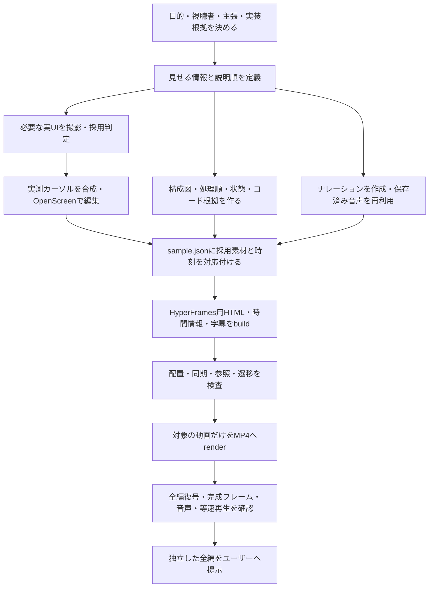

# 動画の生成ルート・確定事項

2026-09-13のPR準備：現行共有版はmain追従の商品紹介v14・技術紹介v17、台本は`projects/tablecast-main-rerecord.json`。新規checkoutと共有素材は[SHARING.md](SHARING.md)、最新の検査・残件はHANDOFF.md冒頭に従う。以下のv13・v16等の記載は制作時点の履歴として保持する。

2026-09-13追記：動画の仕上げを一旦区切り、[WORKFLOW.md](WORKFLOW.md)をアプリ変更に追従する制作入口として整備した。題材別の台本・ブランド・撮影条件、アプリ固有の操作／状態待ち、共通の実測・編集・生成・検査を分ける。`bun run video --project ... --film ... --name ... --render`で指定した入力を新しい保存先へ生成・検査し、実行記録を残す。構成と品質判断は[制作メモ](BRIEF-TEMPLATE.md)で管理する。既存の2本は維持し、以下の制作原則を継続する。

2026-09-13の最新改修：ユーザー評価に従い01〜03を維持し、04以降を一般的な技術資料の図式へ変更した。技術紹介v16（63.1秒）が最新。参考資料と編集判断は [TECHNICAL-DIAGRAMS.md](TECHNICAL-DIAGRAMS.md)、成果物と検査結果はHANDOFF.md冒頭。

2026-09-13の区切りで固定する制作ルート。目的は [Issue #1](https://github.com/kit-codex-hack-fes-2026/tablecast-poc/issues/1) の再生成可能なデモ動画基盤。TableCastの2本は、その基盤を具体化する作例である。

この文書は工程と採用方針の正本。[WORKFLOW.md](WORKFLOW.md) は実行手順、[HANDOFF.md](HANDOFF.md) は今回の到達点・残件・再開方法。過去版の制作メモと食い違う場合は、この文書と最新のユーザー指示を優先する。

2026-09-13の追加指示で、商品紹介は現状維持、技術紹介は一般的な技術デモの調査を踏まえて内容を再定義した。次版の構成・提示内容は [TECHNICAL-BRIEF.md](TECHNICAL-BRIEF.md) を参照する。同日の追加指示で、参照図の3領域を実画面・ロゴ・編集可能な文字と線で構成し、技術紹介v15（6場面・60.8秒）を生成・検査した。最新成果物と検査結果はHANDOFF.md冒頭を参照。

## 成果物の契約

- 商品紹介と技術紹介は、独立した全編MP4を各1本生成する。結合版や抜粋だけをレビュー成果物にしない。
- 商品紹介は約2分、技術紹介は約1分。説明・実音声・読解に必要な尺を使い、120秒／60秒への引き延ばしや早口への圧縮をしない。
- 出力は1920×1080、30fps、H.264/AAC。字幕、必要なナレーション、BGM・章転換SEを含む。
- 商品紹介v13は「いったん採用」。技術紹介v16は「生成・技術検査済み、後半の見た目のレビュー待ち」。今回の工程固定を、技術紹介のデザイン承認に読み替えない。
- 通常の再生成は、同じ台本・素材・保存音声を再利用する。毎回ランダムに内容を変える仕様ではない。

## 工程

1. **定義する。** 商品紹介は「誰が何に困り、どんな操作で何が変わるか」。技術紹介は「何が難しく、なぜその設計にし、どう動き、何で確かめられるか」。台本の主張と実装根拠を先に結ぶ。
2. **撮影を設計する。** 必要な状態・対象・操作・表示条件・保持時間を `capture-plan.json` に書く。たまたま撮れた映像に、後から不適切なズームを付けて帳尻を合わせない。
3. **素材を採用する。** 成功した実UI・実応答と証跡を保存する。失敗テイクを成功扱いにせず、採用済みの素材とは別の保存先を使う。新しい撮影条件を満たしていない旧素材へ証跡を捏造しない。
4. **編集と説明を対応付ける。** 録画の時刻、発話、対象矩形、カーソル、図の注目先を同じ基準で扱う。図は説明内容に適した形式を選ぶ。
5. **生成する。** `sample.json` と保存素材から派生物をbuildし、検査後にrenderする。生成済みHTML・VTTを直接修正しない。
6. **完成品を確認する。** ソースHTMLの静止画だけで終えず、完成MP4を確認する。ユーザーは全編の説明・デザインを評価する。

## 使うものと担当

| 採用するもの        | 担当・境界                                                                                                                      |
| ------------------- | ------------------------------------------------------------------------------------------------------------------------------- |
| Playwright / Chrome | 実UIの操作、DOMイベント、表示対象・時刻の計測。端末viewportの再現は実機検証と区別する                                           |
| OpenScreen 1.11     | 実ウィンドウの録画、実録のズーム・編集・MP4 export。標準version 2 projectとportable形式を使う                                   |
| FFmpeg / FFprobe    | crop・等比scale・pad、実測カーソルの前処理、音声同期・音量、静止画抽出、全編復号・メディア情報確認                              |
| HyperFrames 0.8.33  | 場面、実録・図・字幕・音声の合成と最終書き出し                                                                                  |
| GSAP 3.14.2         | 指定時刻へseekできる強調・移動・遷移。時間はHyperFramesの生成タイムラインに従う                                                 |
| HTML / CSS / SVG    | 配置・文字・端末枠・編集可能な技術図。スタイルは `styles.css`、技術図の内容は `sample.json`                                     |
| Inworld TTS         | ナレーションの必要分だけ生成。現設定はAsuka / inworld-tts-2 / ja-JP / STABLE / LINEAR16 48kHz                                   |
| フリーBGM・SE       | Carefree（Kevin MacLeod、CC BY 4.0）、Kenney Interface Sounds（CC0）。採用素材・加工・出典は [音源記録](assets/audio/README.md) |
| Noto Sans JP        | 保存済みフォントを使用。コード表示のOSフォントやHyperFramesのフォントキャッシュへの依存は環境差として残る                       |
| Bun / Node.js       | スクリプト実行。今回確認した環境はBun 1.3.13、Node.js 25.0.0、Windows。動画依存はworkspace manifestとルートlockで固定           |

OpenAI Realtime・LiveKit・D1等は、撮影対象であるアプリの実行構成。完成動画の通常build/renderで、アプリの有料音声会話を再実行するわけではない。

Windowsの最終書き出しは、v14で使用した `--experimental-fast-capture=false` を明示するルートを基準とする。高速描画の自動判定・自動フォールバックに結果を委ねない。対応する既存オプションを使い、ライブラリやユーザー共通設定を変更しない。

## スキル・追加技術の扱い

- `minimum-impl`：既存実装と標準機能を優先する実装方針。
- `openscreen-demo-video`：録画・OpenScreen編集に必要な手順に限定する。
- HyperFramesの技術資料：導入版のHTML・メディア・タイミング・CLI契約を確認するために使う。別ワークフローの初期化をしない。
- Assertion–Evidence、C4、arc42：技術説明の設計方法として採用する。追加の実行依存ではない。[調査と適用](TECHNICAL-BRIEF.md)を参照。
- Remotion、別のアニメーションエンジン、Slides/PowerPoint、Sites、追加UIキットへ移行しない。スキルの存在だけを理由にインストール・併用しない。
- 生成画像は必須工程ではない。現行の動画用導入・技術図は実画面とHTML/SVGを使う。必要になれば人物のいない補助イラストを検討できるが、架空の画面や実装根拠にはしない。アプリ内の商品画像と、動画用に新規生成する素材は区別する。

詳しい採用・非採用の記録は [TOOLS.md](TOOLS.md)。

## 重要な制作規則

| 対象           | 固定する原則                                                                                                                                     |
| -------------- | ------------------------------------------------------------------------------------------------------------------------------------------------ |
| 冒頭           | 最初のフレームからサムネとして読める。商品紹介は実画面と見出しから始め、実演へ自然につなぐ                                                       |
| 役割と端末     | 商品紹介は客＝iPad、店員＝iPhone、管理者＝MacBook＋ウィンドウ枠。誰の操作・発話かを明示する                                                      |
| ズーム         | 全体で文脈を渡す→意味のある対象へ寄る→読める時間を保つ→次へつなぐ。倍率は対象の全文と余白から選ぶ。[ZOOM.md](ZOOM.md)を適用                      |
| カーソル       | 実操作の直前600ms〜直後350msだけ。先端・指先を実測位置へ合わせる。現在26px相当。ズーム前に合成し、二重表示を防ぐ。[POINTER.md](POINTER.md)を適用 |
| 技術図         | 構成・実行順・状態・実装根拠をそれぞれ適した図にする。構成図は責務と境界、シーケンス図は主体と順序、状態図は条件と変化                           |
| 情報密度       | 詳細は画面に残し、音声で重要箇所を選ぶ。通常再生で主張を理解でき、停止すると詳細を読める階層を作る                                               |
| アニメーション | 通信・状態変化・注目先・全体と詳細の関係を説明する。意味のない横移動、漂うポインター、読めない速さを避ける                                       |
| レイアウト     | 本文・字幕・脚注を分離。対象から外れた矢印、文字の切れ、画像の縦横比の崩れは出力前に修正する                                                     |
| 音声           | 実会話は収録音声を使い、AIの返答を別TTSで置換しない。ナレーションはキャッシュを使い、新しい発話だけ明示生成する                                  |
| 根拠           | 実装、コード抜粋、実行した検査、未検証を区別する。架空ログ・未測定の効果・未実施の受入を実績として表示しない                                     |

## 正本と再生成の境界

| 入力・担当ファイル                                                         | 内容                                                                   |
| -------------------------------------------------------------------------- | ---------------------------------------------------------------------- |
| `sample.json`                                                              | 2本の構成、台本・字幕・発話、採用素材、cut、ズーム、図、強調時刻、音源 |
| `capture-plan.json`                                                        | 次に撮りたい情報と採用条件。更新しただけでは採用済み素材を交換しない   |
| `styles.css` / `scripts/tablecast-build.ts`                                | 配置、合成、派生物の生成                                               |
| `scripts/tablecast-project.ts`                                             | 入力検証、発話・素材参照、音声キャッシュ、タイムライン                 |
| `scripts/tablecast-technical-schema.ts` / `tablecast-technical.ts`         | 技術図の定義・参照検証とHTML/SVG・GSAPへの変換                         |
| `scripts/tablecast-shot.ts` / `tablecast-zoom.ts` / `tablecast-cursor.ts`  | 撮影条件、対象とズームの対応、実測カーソル                             |
| `assets/openscreen/` / `assets/demo/` / `assets/audio/` / `assets/images/` | 元録画と編集証跡、編集済み動画、保存音声、採用画像                     |
| `dist/product/` / `dist/technical/`                                        | 再生成されるHTML・timing.json・字幕・素材コピー。直接編集しない        |
| `output/`                                                                  | 完成MP4・比較用動画・検証記録。生成入力の代わりにしない                |

現状で自動化しているのは、入力検証、計測を使った一部撮影・編集、保存音声の再利用、合成・書き出し・機械検査。
主張と根拠の選定、応答に合う字幕・カット、採用判断、技術図の内容・座標・発話オフセットには手動判断が残る。

アプリの実装が変わった場合は、根拠・撮影条件・必要な素材・説明を更新したうえで再生成する。**旧録画を再renderしただけでは、アプリ変更を反映した動画にはならない。** キャッシュを使った再書き出しと、新しい撮影・TTSを伴う制作を混同しない。新しい音声・実応答は変動するため、採用した結果を保存して再利用する。

このルートは制作方法の固定であり、別マシンでの完全再現・ビット単位で同一のMP4・Issue #1全体の完了を保証するものではない。環境移行と残件は [HANDOFF.md](HANDOFF.md) に記録する。
