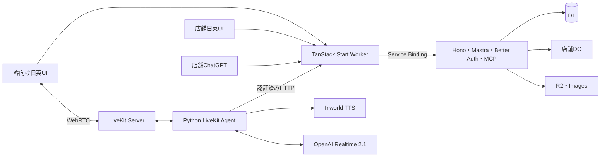

# 構成とディレクトリ

[索引](README.md)

## 実行単位



Web/APIの2 WorkersとPython Agentに限定する。DOのclassはAPI Workerに置く。独立したMastraサーバー、画像Worker、翻訳Workerは初期には追加しない。
業務の正本はD1。LiveKitは現在の音声と再生状況、OpenAI Realtimeは音声理解と応答生成、Mastraのツール定義はAPI内の業務操作、DOは通知を担当する。

## ディレクトリ

APIは業務moduleごとに入力、操作、読取を所有する。処理がない層のファイルは作らない。

```text
tablecast/
├── AGENTS.md
├── .agents/skills/
├── docs/
├── apps/
│   ├── web/
│   │   ├── .storybook/
│   │   ├── src/
│   │   │   ├── routes/
│   │   │   ├── features/kiosk/
│   │   │   ├── features/admin/
│   │   │   ├── components/
│   │   │   ├── i18n/
│   │   │   └── lib/api.ts
│   │   ├── e2e/
│   │   ├── vite.config.ts
│   │   ├── wrangler.jsonc
│   │   └── package.json
│   └── api/
│       ├── src/
│       │   ├── app.ts
│       │   ├── worker.ts
│       │   ├── client.ts
│       │   ├── schema.ts
│       │   ├── platform/
│       │   ├── modules/auth/
│       │   ├── modules/account/
│       │   ├── modules/stores/
│       │   ├── modules/configuration/
│       │   ├── modules/devices/
│       │   ├── modules/voice/
│       │   ├── modules/mcp/
│       │   ├── modules/media/
│       │   ├── modules/system/
│       │   ├── modules/catalog/
│       │   ├── modules/orders/
│       │   ├── modules/tables/
│       │   ├── db/
│       │   └── realtime/
│       ├── migrations/
│       ├── test/
│       ├── drizzle.config.ts
│       ├── wrangler.jsonc
│       └── package.json
├── livekit/
│   ├── src/tablecast_livekit/
│   ├── tests/
│   ├── pyproject.toml
│   ├── uv.lock
│   └── package.json
├── scripts/
├── fixtures/demo/
├── patches/livekit-inworld/
├── package.json
├── bun.lock
├── turbo.json
├── oxlint.config.ts
├── oxfmt.config.ts
├── lefthook.yml
├── .gitignore
└── .worktreeinclude
```

rootのBun workspacesは `apps/*` と `livekit`。Python配下のpackage.jsonはTurboからuvを呼ぶ薄いタスク窓口で、Python依存は記載しない。
独自名は `@tablecast/web`、`@tablecast/api`、`@tablecast/livekit`。Python distributionは `tablecast-livekit`、moduleは `tablecast_livekit` とする。

## 業務moduleと依存の寿命

Webは機能単位のfeature、APIは業務単位のmoduleを基本にする。小さな処理にcontroller/service/repository/interfaceを一組ずつ生成しない。
APIではroute・Mastra Tool・MCPが同じ注文操作関数を呼び、必要なDrizzle queryと純粋な価格・条件判定をそこから利用する。
価格計算等を `pricing.ts` に切り出すことは有用だが、そのための共有domain packageは不要。
DB queryが十分短ければ操作関数内に置いてよい。複雑なqueryの所有ファイルを分ける場合も、単なる引数の中継層を追加しない。

`app.ts`はHonoの共通middlewareとmoduleを組み立てる。`platform/context.ts`の`requestServices`がHTTPリクエストごとにDrizzleを一度生成し、同じ`ApiServices`をroute・service・Agentツールへ渡す。Better Authは最初の利用時に同じDBで生成し、スタッフsessionの取得PromiseはHono Contextで共有する。次のリクエストへDB・Auth・sessionを持ち越さず、healthや画像はAuth設定に依存しない。

| 所有者                                                                | 責務                                                                       |
| --------------------------------------------------------------------- | -------------------------------------------------------------------------- |
| `platform/context.ts`、`platform/http.ts`                             | リクエスト依存、trace・Origin検査、共通エラー応答                          |
| `modules/auth/middleware.ts`                                          | スタッフ認証、店舗membership、端末CookieからActorを確定                    |
| `modules/*/routes.ts`、`*-routes.ts`                                  | HTTP入力の検証、認可middleware、業務操作呼出し、JSON・Cookie・streamの出力 |
| `modules/*/service.ts`、音声の`session.ts`・`realtime.ts`・`turns.ts` | Hono Contextに依存しない業務判断、条件付き更新・batch、音声の競合・停止    |
| `modules/*/queries.ts`、`tables/history.ts`                           | 複数呼出し元で利用する読取、tenant条件、集計・ページング                   |
| `modules/*/model.ts`                                                  | 業務別の入出力schema・型。共通のID・言語は`platform/model.ts`              |
| `db`、`migrations`                                                    | D1 schema・制約・移行。汎用repositoryや別DBのadapterは設けない             |

GUI・音声・MCPは同じserviceを利用する。注文確定のsnapshot、版の比較、mutation_id、`changes()`を用いた条件付きbatchは元の原子性を保つ。serviceからrouteを呼び戻さず、音声Room操作は`voice/runtime.ts`へ依存する。

HTTP入力schemaは所有moduleに置く。Web向けのHono RPC clientは `@tablecast/api/client`、共有が必要な公開型・schemaだけは `@tablecast/api/schema` から明示公開する。
これはAPI自身の公開面であり、別のcontracts packageではない。WebがAPIのDB・auth・Mastra実行コードをruntime importしないことをbuildで確認する。
型はtype-only importで扱い、画面専用のstateと業務契約を無理に一つにしない。Pythonとの少数のJSON契約はAPI schemaを正本にして実データの契約テストで照合する。全APIの巨大SDKは生成しない。

共有packageを作るのは、実在する独立した複数consumerと、切り出した方が変更箇所を減らす根拠がある場合だけ。

## 単一オリジン

Web入口が `/api/*`、`/mcp`、OAuth metadata、`/media/*`、認証済み `/internal/voice/*` をService Bindingで内部転送する。[S10](sources.md#s10)
別APIホストへのredirectはしない。レスポンスのstream、AbortSignal、複数Set-Cookie、WebSocket upgradeを維持し、bodyを全読みしない。

同一オリジンにすることで広いCORS許可やCookieのドメイン共有は不要になる。ただし通常のSecure/HttpOnly/SameSite、CSRF、認可、OAuth callback設定は必要。
Cookieはhost-only。認証済み応答、カート、注文、ログは共有キャッシュに置かない。
LiveKitのsignalingとWebRTCメディアは別の通信経路であり、UDPをService Bindingへ通す設計にはしない。

## 認証・設定・公開境界

認可されたコンテキストをHonoが確定し、Mastra RequestContextへ渡す。LLMの店舗IDを信用しない。
MCPやVoiceのサービスtokenはブラウザーCookieと分け、内部パスという名称だけで安全と扱わない。
開発用seed・リセット・模擬イベントの経路は、本番bundleに含めないか、本番で確実に無効化し試験する。

設定は下書き→検証→公開。公開版は変更せず、新版を作る。注文に適用した商品名・modifier・価格・ルールを保存し、後日の変更から独立させる。
将来のPostgresのためだけにrepository interfaceや二重DB adapterを作らない。D1の実制約と移行手順をテストする方を優先する。

## Web/APIの型境界と店舗

Honoのroute chainから `AppType` を推論し、`@tablecast/api/client` の公開入口で `hc<AppType>` を提供する。Webの業務APIはこのクライアントとHonoの `parseResponse` を使い、レスポンス用Zodを二重定義しない。外部入力のZod検証と認可はAPI側に残す。エラー応答だけはWebの共通fetch境界で正規化する。

`components/ui` は業務を知らないshadcn/Base UI部品、`components` はDataTable・日時・ユーザー表示、`features/store` は店舗のメニュー・メンバー・招待・端末、`features/account` は本人の認証設定を所有する。ai-elementsは `components/ai-elements` に置く。

migration 0011で店舗と組織を1対1にする。以前の複数店舗組織は店舗単位へ分割し、管理者は各店舗、一般メンバーは従来所属していた店舗へ引き継ぐ。旧teamの表は移行履歴として残すが、アクセス判定では使わない。店舗・卓・注文のIDとカートは変えない。分割した組織のOAuth承認は再取得する。

Cloudflareの `nodejs_compat_do_not_populate_process_env` を指定し、Workerの設定はbindingsで受け取る。Webの型検査はAPIが生成したCloudflare Env宣言を参照する。

## 本番・PRの配備境界

mainは`tablecast.kit-codex.workers.dev`、同一repoのPRは`tablecast-pr-<番号>.kit-codex.workers.dev`へGitHub Actionsから配備する。Web/APIのService BindingとAPIによる業務判断を維持し、D1/R2/DO/Containersは環境別、LiveKit CloudはRoom/agent名を分離した共有projectにする。Pythonを起動するDOが同時1 sessionの予約と更新受付を管理する。PRのOAuth emulatorも専用Containerで、公開入口はAccessで保護する。本番Google、secrets、初期投入、停止・復旧の契約は[公開手順](deployment.md)を参照する。
