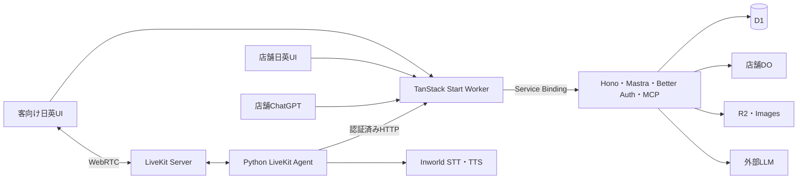

# 構成とディレクトリ

[索引](README.md)

## 実行単位



Web/APIの2 WorkersとPython Agentに限定する。DOのclassはAPI Workerに置く。独立したMastraサーバー、画像Worker、翻訳Workerは初期には追加しない。
業務の正本はD1。LiveKitは現在の音声と再生状況、Mastraは渡された文脈に対する推論、DOは通知を担当する。

## 目標ディレクトリ

以下は必要に応じて作る構造で、空の箱を先に全部作る指示ではない。

```text
tablecast/
├── AGENTS.md
├── .agents/skills/
├── docs/
├── apps/
│   ├── web/
│   │   ├── .storybook/
│   │   ├── src/
│   │   │   ├── routes/
│   │   │   ├── features/kiosk/
│   │   │   ├── features/admin/
│   │   │   ├── components/
│   │   │   ├── i18n/
│   │   │   └── lib/api.ts
│   │   ├── e2e/
│   │   ├── vite.config.ts
│   │   ├── wrangler.jsonc
│   │   └── package.json
│   └── api/
│       ├── src/
│       │   ├── app.ts
│       │   ├── worker.ts
│       │   ├── client.ts
│       │   ├── schema.ts
│       │   ├── auth.ts
│       │   ├── agent/
│       │   ├── mcp/
│       │   ├── modules/catalog/
│       │   ├── modules/orders/
│       │   ├── modules/tables/
│       │   ├── db/
│       │   └── realtime/
│       ├── migrations/
│       ├── test/
│       ├── drizzle.config.ts
│       ├── wrangler.jsonc
│       └── package.json
├── livekit/
│   ├── src/tablecast_livekit/
│   ├── tests/
│   ├── pyproject.toml
│   ├── uv.lock
│   └── package.json
├── scripts/
├── fixtures/demo/
├── patches/livekit-inworld/
├── package.json
├── bun.lock
├── turbo.json
├── oxlint.config.ts
├── oxfmt.config.ts
├── lefthook.yml
├── .gitignore
└── .worktreeinclude
```

rootのBun workspacesは `apps/*` と `livekit`。Python配下のpackage.jsonはTurboからuvを呼ぶ薄いタスク窓口で、Python依存は記載しない。
独自名は `@tablecast/web`、`@tablecast/api`、`@tablecast/livekit`。Python distributionは `tablecast-livekit`、moduleは `tablecast_livekit` とする。

## 層ではなく責務を分ける

Webは機能単位のfeature、APIは業務単位のmoduleを基本にする。小さな処理にcontroller/service/repository/interfaceを一組ずつ生成しない。
APIではroute・Mastra Tool・MCPが同じ注文操作関数を呼び、必要なDrizzle queryと純粋な価格・条件判定をそこから利用する。
価格計算等を `pricing.ts` に切り出すことは有用だが、そのための共有domain packageは不要。
DB queryが十分短ければ操作関数内に置いてよい。複雑なqueryの所有ファイルを分ける場合も、単なる引数の中継層を追加しない。

HTTP入力schemaは所有moduleに置く。Web向けのHono RPC clientは `@tablecast/api/client`、共有が必要な公開型・schemaだけは `@tablecast/api/schema` から明示公開する。
これはAPI自身の公開面であり、別のcontracts packageではない。WebがAPIのDB・auth・Mastra実行コードをruntime importしないことをbuildで確認する。
型はtype-only importで扱い、画面専用のstateと業務契約を無理に一つにしない。Pythonとの少数のJSON契約はAPI schemaを正本にして実データの契約テストで照合する。全APIの巨大SDKは生成しない。

共有packageを作るのは、実在する独立した複数consumerと、切り出した方が変更箇所を減らす根拠がある場合だけ。

## 単一オリジン

Web入口が `/api/*`、`/mcp`、OAuth metadata、`/media/*`、認証済み `/internal/voice/*` をService Bindingで内部転送する。[S10](sources.md#s10)
別APIホストへのredirectはしない。レスポンスのstream、AbortSignal、複数Set-Cookie、WebSocket upgradeを維持し、bodyを全読みしない。

同一オリジンにすることで広いCORS許可やCookieのドメイン共有は不要になる。ただし通常のSecure/HttpOnly/SameSite、CSRF、認可、OAuth callback設定は必要。
Cookieはhost-only。認証済み応答、カート、注文、ログは共有キャッシュに置かない。
LiveKitのsignalingとWebRTCメディアは別の通信経路であり、UDPをService Bindingへ通す設計にはしない。

## 認証・設定・公開境界

認可されたコンテキストをHonoが確定し、Mastra RequestContextへ渡す。LLMの店舗IDを信用しない。
MCPやVoiceのサービスtokenはブラウザーCookieと分け、内部パスという名称だけで安全と扱わない。
開発用seed・リセット・模擬イベントの経路は、本番bundleに含めないか、本番で確実に無効化し試験する。

設定は下書き→検証→公開。公開版は変更せず、新版を作る。注文に適用した商品名・modifier・価格・ルールを保存し、後日の変更から独立させる。
将来のPostgresのためだけにrepository interfaceや二重DB adapterを作らない。D1の実制約と移行手順をテストする方を優先する。
