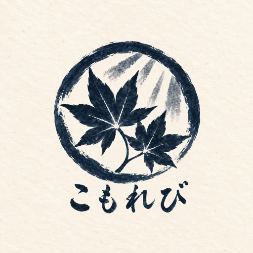
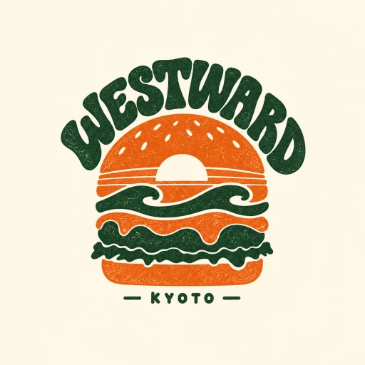
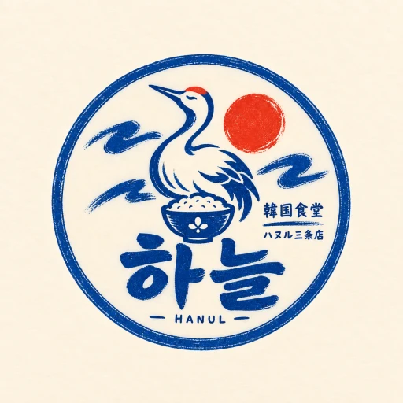
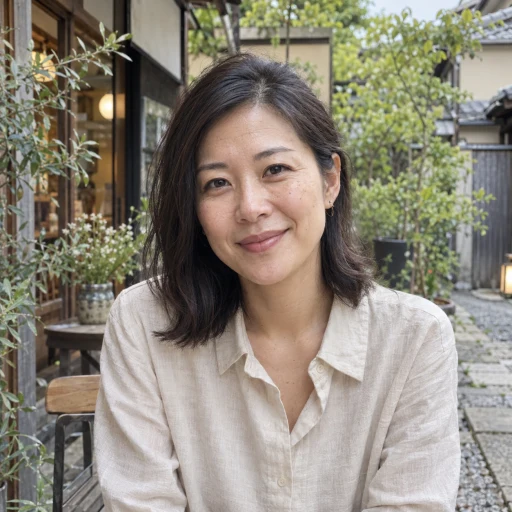
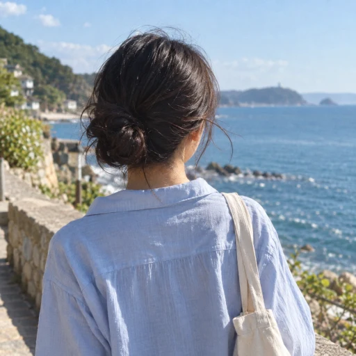
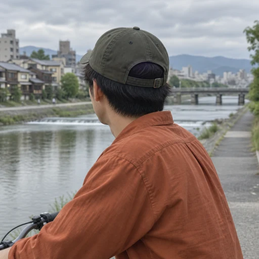
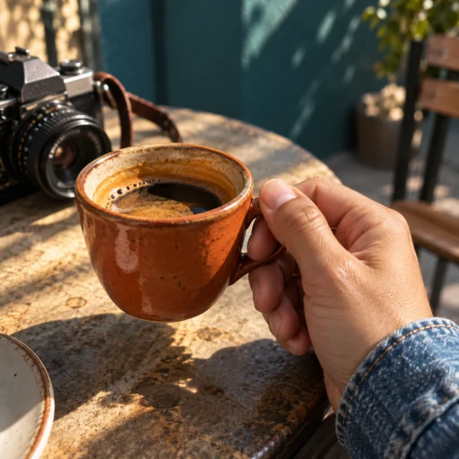
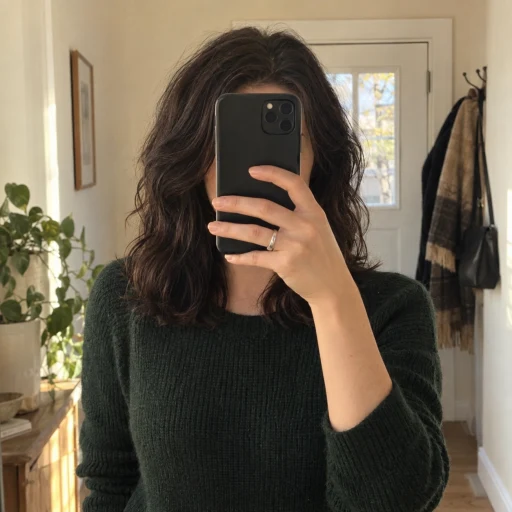
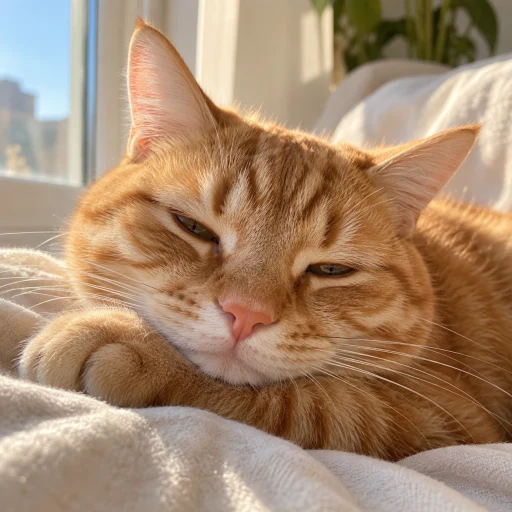

# 店舗ロゴとプロフィール写真

[デモ資料](README.md) / [店舗とメンバー](stores.md)

店舗アカウントらしい3点のロゴと、個人のSNSらしい9点の写真を使う。顔写真だけに統一せず、後ろ姿、趣味の小物、鏡越しの写真、猫を混ぜ、撮影場所・光・服装も分ける。8人の店舗メンバーと、未所属のアカウント連携確認用ユーザーが対象である。

2026-09-14にCodex内蔵imagegenで新規生成した架空の人物・ブランドであり、実在する店舗や従業員の写真ではない。全点512×512のWebP、合計519,870 bytes。顔やロゴの主要部分が丸型アイコンに収まる構図を使う。ロゴの文字は店の意匠であり、氏名や店舗名のUIラベルは別に表示する。

## 店舗ロゴ

| 京料理こもれび四条店                                               | Westward Burgers Kyoto                                             | 韓国食堂ハヌル三条店                                          |
| ------------------------------------------------------------------ | ------------------------------------------------------------------ | ------------------------------------------------------------- |
|  |  |  |
| 和紙色、藍の葉と筆文字                                             | 西海岸の夕日・波・バーガー、緑とオレンジ                           | 鶴と飯碗、青と赤、ハングル                                    |

## メンバーの写真

| 人物・所属                         | 画像                                                                  | 個人らしさ                                         |
| ---------------------------------- | --------------------------------------------------------------------- | -------------------------------------------------- |
| 佐藤 晴香 / こもれび・ハヌル owner |            | 40代、緑のあるカフェ、自然光の顔写真               |
| 田中 蓮 / こもれび admin           |               | 30代、眼鏡、木のカウンターと暖かい照明             |
| 伊藤 葵 / こもれび member          |                  | 海を眺める後ろ姿、青いシャツ                       |
| 小林 直子 / ハヌル admin           |        | 40代、川辺の散歩、デニムの顔写真                   |
| 森 悠真 / ハヌル member            |                | 自転車と川辺、帽子をかぶった後ろ姿                 |
| 山本 翼 / Westward owner           |         | コーヒーカップを持つ手とカメラ                     |
| 中村 美咲 / Westward admin         |        | 緑のニット、スマートフォンで顔を隠した鏡越しの写真 |
| Alex Morgan / Westward member      |          | 30代、巻き毛、青いシャツ、煉瓦の背景               |
| 小川 凛 / 未所属・連携確認         |  | 窓辺の茶トラ猫                                     |

## 実装との対応

[共通名簿](../../apps/emulate/src/tablecast-demo-identities.ts)が各ファイルと人物・店舗を対応付ける。氏名・メール・権限・所属数は写真とは独立して保持する。接客UIで話す人物アバターは別Issueの構想であり、このプロフィール画像の対象に含めない。

seedは同じWebPをR2へ保存し、DBの`user.image`と`organization.logo`から既存のアバター配信経路を使う。模擬GoogleはWebPをdata URLとして読み込み、コンテナにも同じ12ファイルを同梱する。追加の外部画像ホストを必要としない。

既存のlocal/PR環境は通常のseed・再配備で、空欄または旧seedのSVGアイコンURLだけを新画像へ更新する。管理者メールを変更したローカル資格情報も同じ名簿に対応付ける。手動設定した画像、氏名、所属、店舗設定、注文履歴はこの画像更新で上書きしない。

旧あかりから移行したハヌルに残る、あかりの既定SVG URLも更新する。対象は移行先ハヌルの組織に限定し、旧店舗を再作成したりカタログを再投入したりしない。

新しいURLは画像内容のSHA-256から生成するUUIDを使い、長期キャッシュされた旧SVGとは別キーになる。旧キーは過去の参照向けに残し、同じキーへ異なる画像を上書きしない。

[生成プロンプトとSHA-256](../../assets/demo/identities/prompts.json)には全12点の原本識別子・編集指示・原本とWebPのハッシュを記録する。PNGからWebPへの処理は`cwebp -q 88 -resize 512 512`による縮小・圧縮だけである。PRの確認用スクリーンショットはこのアセットディレクトリへ保存しない。

## メールとGoogleでの表示名

メールは名.姓@店舗名.comに揃える。こもれびは`komorebi-shijo.com`、Westwardは`westward-burgers-kyoto.com`、ハヌルは`hanul-sanjo.com`を使う。共有オーナーの佐藤晴香はこもれびのアドレス、未所属の小川凛は同ドメインの連携確認専用アドレスを持つ。

Google選択画面は氏名・店舗名・権限（owner/admin/member）を主行、メールを副行に表示する。デモ人物が登録されている場合はemulate既定のTest Userを一覧から外す。表示上の権限は案内であり、実際の認可はログイン後のDB所属による。

既知の旧デモメールは通常のseed・PR再配備で新メールへ移行する。ユーザーID・所属・パスワード・実Googleの識別子を保持し、既存の模擬Google連携は同じユーザーIDのまま新メールへ対応付ける。旧田中蓮の一般スタッフ所属だけは、旧メールからの移行時にこもれびの管理者へ補正する。移行後に手動変更した権限は通常のseedで戻さない。手動のメールは変更しない。新旧メールが別ユーザーとして同時に存在する場合は自動統合せず停止する。ローカルの資格情報ファイルはDB投入成功後にメールだけを更新する。
