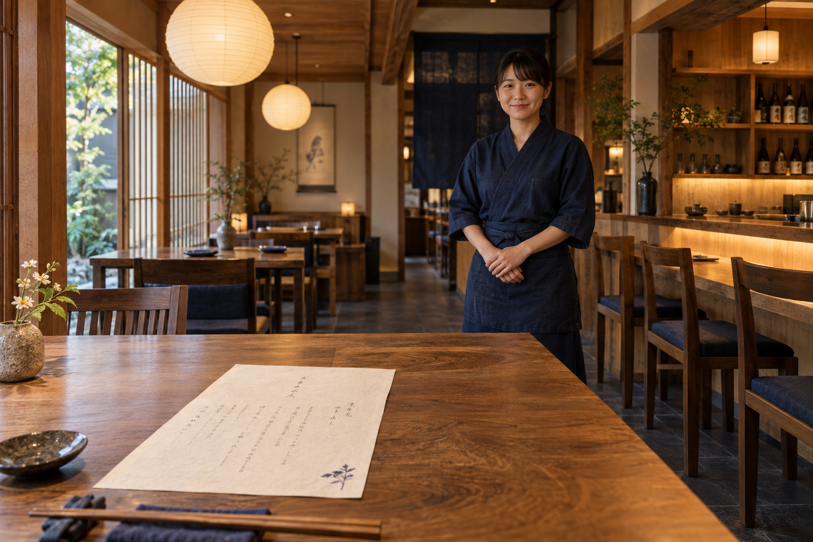
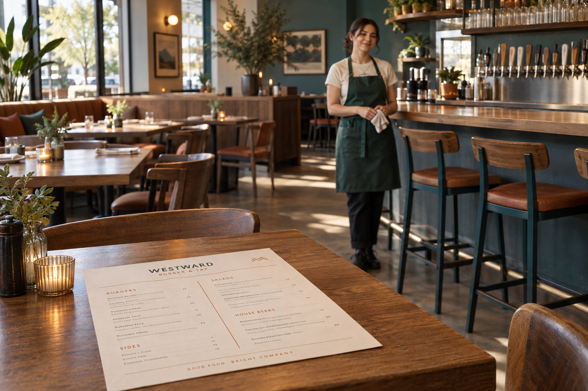

# デモ店舗の設定

[デモ資料](README.md) / [ペルソナ](personas.md) / [実装との対応](capabilities.md)

## 店舗と組織

| 固定店舗ID           | 店名                   | 担当するデモ                                               | 組織の構成                           |
| -------------------- | ---------------------- | ---------------------------------------------------------- | ------------------------------------ |
| `tablecast-komorebi` | 京料理こもれび四条店   | 主役。料理・酒の相談、英語、食事条件、定額プランと単品     | 専用の1組織、owner/admin/member各1名 |
| `tablecast-koharu`   | Westward Burgers Kyoto | 主役。選択肢の多いバーガー、クラフトビール、店舗の個性     | 専用の1組織、owner/admin/member各1名 |
| `tablecast-hanul`    | 韓国食堂ハヌル三条店   | 主役。取り分け、辛さ、食べ方、卓上調理の相談とスタッフ連携 | 専用の1組織、owner/admin/member各1名 |

京料理こもれび四条店の英語案内名は Komorebi Shijo とする。製品の店舗表示名は上表の店名を使う。

こもれびとWestwardは既存の店舗IDを維持する。韓国食堂ハヌル三条店は専用IDの`tablecast-hanul`を持ち、新規DB・明示リセットの初期構成で旧あかりに代わる。3店舗・3組織・各3所属を基本とする。複数店舗を管理するownerを共有するため、8人・9所属となる。模擬ログインでは氏名・所属・役割・アイコンを見て選べるようにする。

| 店舗                                       | 氏名        | role・担当           | 模擬Googleメール                              |
| ------------------------------------------ | ----------- | -------------------- | --------------------------------------------- |
| 京料理こもれび四条店・韓国食堂ハヌル三条店 | 佐藤 晴香   | owner・2店舗の責任者 | `haruka.sato@komorebi-shijo.com`              |
| 京料理こもれび四条店                       | 田中 蓮     | admin・店長          | `ren.tanaka@komorebi-shijo.com`               |
| 京料理こもれび四条店                       | 伊藤 葵     | member・ホール担当   | `aoi.ito@komorebi-shijo.com`                  |
| 韓国食堂ハヌル三条店                       | 小林 直子   | admin・店長          | `naoko.kobayashi@hanul-sanjo.com`             |
| 韓国食堂ハヌル三条店                       | 森 悠真     | member・ホール担当   | `yuma.mori@hanul-sanjo.com`                   |
| Westward Burgers Kyoto                     | 山本 翼     | owner・店舗責任者    | `tsubasa.yamamoto@westward-burgers-kyoto.com` |
| Westward Burgers Kyoto                     | 中村 美咲   | admin・店長          | `misaki.nakamura@westward-burgers-kyoto.com`  |
| Westward Burgers Kyoto                     | Alex Morgan | member・ホール担当   | `alex.morgan@westward-burgers-kyoto.com`      |

[店舗ロゴとプロフィール写真](identities.md)に各画像と人物の対応・生成元をまとめる。

[共通名簿](../../apps/emulate/src/tablecast-demo-identities.ts)の氏名・所属ラベル・アイコンをseedと模擬OAuthで共有する。`rin.ogawa@komorebi-shijo.com`は小川凛の未所属アカウント連携確認専用で、店舗の8人・9所属に含めない。メールやOAuthの表示roleから権限を与えず、認証後のDB所属を使う。

各3所属は新規DBまたは明示的なリセット時の初期状態である。通常の再seedで既存メンバー・編集した氏名・パスワード・手動メールを削除や上書きしない。新規のローカル資格情報は名簿と同じ既定メールを使い、既存の`.local/demo.json`はパスワードと手動メールを維持し、既知の旧デモメールだけをseed成功後に移行する。通常の再seedで旧あかりを含む既存店舗や履歴を削除しない。

## 京料理こもれび四条店

架空の京都・四条の路地にある、木と和紙の落ち着いた小料理店。京料理を初めて食べる人にも、食材や出汁、酒の温度を短く説明する。会話の余白を保ち、登録済みの情報に基づく相談相手として接客する。

| 項目         | 設定                                                                                                                                                    |
| ------------ | ------------------------------------------------------------------------------------------------------------------------------------------------------- |
| 主な利用     | 2名の夕食、旅行中の食事、小さな会食                                                                                                                     |
| メニュー     | 架空の日本酒28銘柄、和食24品、その他飲料8品。合計60商品                                                                                                 |
| 選択肢       | 日本酒の温度・容量、料理に合う薬味、味付け、数量付き追加。発泡清酒に熱燗など不自然な組合せを作らない                                                    |
| 注文方式     | プランなしの単品、京の三皿コース2,200円/人、日本酒とお飲み物 飲み放題3,200円/人、和食の食べ放題3,800円/人。料金・対象品・制限は既存planの範囲で登録する |
| 内装         | 暖色の和紙ペンダント照明、木目の卓と梁、木格子からの自然光、土壁、藍色の座面や暖簾。画像内にiPadやアプリ画面は含めない                                  |
| 紙のお品書き | 生成り色の和紙、余白を取った縦の構成、墨色の細い文字、藍色の小さな装飾。画像中の文字・価格は設定データの正本にしない                                    |
| 制服         | 藍色の作務衣風の上着と同系色の前掛け。架空の店員1名が着用し、実在の従業員や会社制服を参照しない                                                         |
| テーマ構想   | 生成り・墨・藍、見出しは明朝系、本文は読みやすいゴシック系。色・フォントの店舗設定は将来機能                                                            |

京の三皿コースはお造り・唐揚げ・枝豆から1人3品まで選べる定額プランで、同じ料理も1品として数える。90分制、ラストオーダーは終了20分前、提供順はスタッフが対応する。コースという呼び方は、この料金と対象商品の範囲で使う。料理の順番管理や自動配膳ができるという意味にはしない。架空酒の名称・香味説明を実在蔵元の情報として紹介しない。

## Westward Burgers Kyoto

架空の京都市内にあるバーガーとクラフトビールの店。西海岸の軽やかな雰囲気を取り入れ、カスタマイズする楽しさを接客と写真で伝える。店内をにぎやかに描いても、実際の騒音下で認識精度を確認したことにはしない。

| 項目         | 設定                                                                                                                                                            |
| ------------ | --------------------------------------------------------------------------------------------------------------------------------------------------------------- |
| 主な利用     | 2〜3名の友人同士、仕事帰りの食事、好みの異なるグループ                                                                                                          |
| メニュー     | バーガー3品、サイド4品、架空クラフトビール3品、ノンアルコール飲料2品の12商品。こもれび60商品・ハヌル30商品と合わせて102商品。容量や追加具材で商品を水増ししない |
| 選択肢       | バンズ・パティ・チーズ・ソースの必須選択、任意の具材抜き、数量付きの追加トッピング。候補・追加料金・可否はカタログを正本にする                                  |
| ビール       | 架空の西海岸スタイルIPA等。苦味・香り・容量を登録文で比較し、実在ブランドの評価と混同しない                                                                     |
| 内装         | ウォールナット色の卓・カウンター、ティールの壁、錆オレンジや茶色の座面、大きな窓、観葉植物、ステンレスのビールタップ                                            |
| 紙のメニュー | 生成り色の紙、2列を基本とした余白のある構成、深緑の店名と錆オレンジの見出し・罫線。画像中の紙面は文字中心で料理写真を含まない                                   |
| 制服         | 生成り色のTシャツ、深緑のエプロン、濃色のパンツ。架空の店員1名が着用する                                                                                        |
| テーマ構想   | 生成り・深緑・ティール・錆オレンジ、見出しはサンセリフ、本文は日英とも読みやすい書体。店舗テーマの設定は将来機能。選択肢画像の設定はIssue #122の上段PRで扱う    |

商品ごとの写真を用意し、録画の主要商品には[カスタムバーガー](../../assets/demo/westward-westward-classic.webp)と[IPA](../../assets/demo/westward-westward-ipa.webp)の生成イメージを使う。商品に登録する`imageKind`は`illustration`とする。構想画像中の紙面は、実装済みの画像領域リンクやテーマを表すものではない。

| 主要商品                          | 基本価格      | 収録で示す内容                                                                                                             |
| --------------------------------- | ------------- | -------------------------------------------------------------------------------------------------------------------------- |
| ウエストワード・カスタムバーガー  | 1,380円       | ブリオッシュ、ビーフ、チェダー、ハウスソースを基本とし、全粒粉は50円追加、植物由来パティは150円追加。チーズなしは100円減額 |
| グリルチキンバーガー              | 1,280円       | 十分に加熱した鶏肉。バンズ・チーズ・ソースと具材抜き・追加を選ぶ                                                           |
| きのこと植物由来パティのバーガー  | 1,480円       | ブリオッシュ・チェダー・卵入りソースを含む。植物由来パティだけでヴィーガン対応を保証しない                                 |
| シーソルトフライ                  | 580円         | チェダー150円・アボカド200円・ベーコン250円の数量付き追加。揚げ油の共用を説明する                                          |
| パシフィック・ウエストコーストIPA | 880円 / 280ml | 柑橘系の香り、明瞭な苦味、6.5%。473mlは300円追加                                                                           |
| サンセット・ペールエール          | 820円 / 280ml | 穏やかな苦味、5.0%。IPAとの比較                                                                                            |
| ナイトフォール・スタウト          | 920円 / 280ml | 焙煎麦芽の香り、6.0%。初期状態は売切                                                                                       |
| ゆずソーダ                        | 480円         | 飲酒しない客にも同じ卓で提案できる飲料                                                                                     |

価格は合成fixtureの初期値であり、収録時に公開設定と照合する。追加具材は各2個まで、合計4個までを設定する。数量を変えると同じAPIで金額を再計算する。

## 韓国食堂ハヌル三条店

架空の京都・三条にある、友人同士で韓国料理を取り分ける食堂。初めての料理の食べ方、二人前セットの量、辛さと追加具材を相談できる。料理に慣れていることや辛いものが好きなことを、年齢・名前・言語から決めつけない。詳細は[韓国料理の設定と接客](korean.md)を参照する。

| 項目         | 設定                                                                                             |
| ------------ | ------------------------------------------------------------------------------------------------ |
| 主な利用     | 3人の友人同士、料理を取り分ける夕食、初めて韓国料理を食べる客                                    |
| メニュー     | 料理20品、アルコール5品、ノンアルコール5品の30商品                                               |
| 選択肢       | 包み野菜、別添えのたれ、辛さ、数量付き追加具材、取り分ける器の人数。セット数・本数・人数を分ける |
| 注文方式     | プランなしの単品と、ノンアルコール飲み放題1,280円/人。90分・1人4杯まで                           |
| 内装         | 青いタイル、赤い椅子、丸いステンレス卓、柔らかい夕方の光。明るく気軽な雰囲気                     |
| 紙のお品書き | 大きな料理写真に日本語・韓国語の読み・英語名を添え、辛さと取り分け量を短く説明                   |
| 制服         | 生成りのTシャツ、藍の腰エプロン、小さな赤い名札。架空の設定であり本人の写真ではない              |
| テーマ構想   | 青・赤・ステンレスの軽快な組合せ。店舗色・フォント設定は将来機能                                 |

| 主要商品                             | 基本価格      | 収録で示す内容                                                                            |
| ------------------------------------ | ------------- | ----------------------------------------------------------------------------------------- |
| サムギョプサル 卓上焼きセット 二人前 | 2,680円       | 豚バラ300g・サンチュ6枚。サンチュ3枚とえごま3枚は100円追加。みそだれ別添えを選べる        |
| 海鮮チヂミ 八切れ                    | 1,080円       | しょうゆ酢だれ・唐辛子入りしょうゆだれ・たれなしを選ぶ。八切れを注文数量8個と取り違えない |
| 海鮮スンドゥブ                       | 1,080円       | 辛さ控えめでも唐辛子を含む。チーズ150円・トック180円・ラーメン200円を数量付きで追加       |
| ハヌル お米のマッコリ                | 880円         | 架空の750ml・6%。取り分ける器2・3・4人分を選ぶ。器3人分でもボトルは1本                    |
| ハヌル 栗マッコリ                    | 980円         | 初期状態は売切。代替の提案と在庫の登録状態を分ける                                        |
| ゆず茶 / とうもろこし茶              | 480円 / 380円 | 温かい・冷たいなどを文言で選び、飲酒しない客も一緒に相談できる                            |

卓上の加熱機器はスタッフが操作する。焼き方や食べ頃が分からない場合は呼出しへつなぎ、料理を見ていないAIが加熱完了を断定しない。宗教適合・交差接触・ヴィーガン対応は未確認情報として扱う。森悠真のmember画面ではこの呼出しと提供へ対応し、他店の営業データを参照できないことも確認する。

## 画像と設定の関係

内装・制服・紙面の画像はデザイン参考資料であり、店舗設定schemaの新項目ではない。商品102点には各店の料理と器に合わせた個別画像を用意し、店舗間で同じ汎用写真を使い回さない。[商品写真一覧](photos.md)で商品名と参照画像を照合する。

選択肢は全92件のうち、見た目で選ぶ63件へ62枚の写真を紐付ける。内訳はこもれび23枚・Westward17枚・ハヌル22枚で、Westwardの同じチェダーは選択と追加で同じ写真を参照する。残る29件は辛さ・温度・なし等を文言や記号で伝える。この設定と客画面はIssue #122の上段PRの範囲である。

商品と選択肢の写真は料理・材料の輪郭を切らず、対象の長辺85〜92%・四辺4〜7%程度の最小余白を目安にする。皿の縁だけは切れてよいが、容量比較など器が対象なら器全体を残す。商品表示は正方形の枠で`contain`を使い、ホバーで拡大して切り取らない。実容量や内容は写真の大きさから推測させず、名前・価格・説明を併記する。

[入力用メニュー資料](source-menu.md)は各店の実fixtureから代表商品を抜粋している。設定シーンではこの価格・選択肢・原材料確認状態を使い、生成画像の紙面から読み取った値を正本にしない。商品画像でピクルスやソースなど全材料が見えるとは限らず、画像から含有・除去を保証しない。
