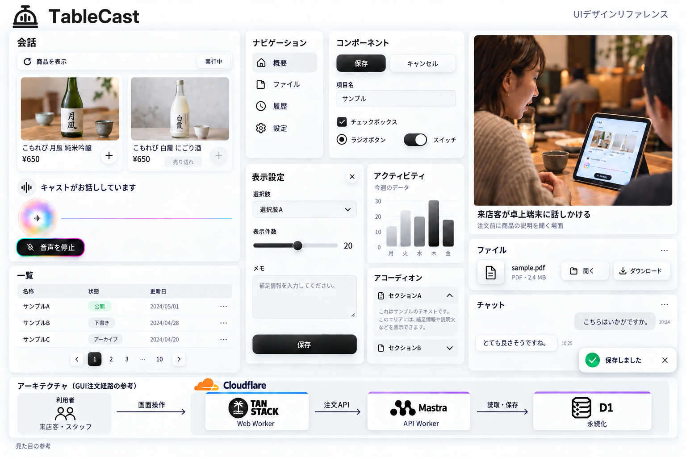

# TableCast デザインリファレンス

[共通デザイン基準](../../DESIGN.md) · [制作プロンプト](source/UNIFIED.md)

## 統合リファレンス

[PNG](references/representative.png) · [制作記録と生成プロンプト](source/UNIFIED.md)

これまでの代表画像と部品一覧に、来店客が卓上端末へ話しかける写真調の場面を加え、1枚へまとめた。写真は暖かい映画調の色とフィルムグレインを使い、役割・状況・行動をキャプションで示す。実店舗の撮影記録ではない。

波形は現行実装の細い連続線、orbは白い円のSmokeRingと中央の状態アイコンを基準にする。色と影だけを資料の質感に合わせ、棒状波形や球体へ作り替えない。正本TableCastロゴはSVGからそのまま配置し、1個だけ埋め込む。

汎用部品はサンプルであり、製品機能の追加を指示しない。店舗AIは外部ChatGPTのAgent Plugin、来店客はログインしないという前提を維持する。色・角丸・フォントの個別画像と数値注記は作らず、[DESIGN.md](../../DESIGN.md)に定義する。

画像本体は内蔵画像生成、ロゴは正本SVGを合成してPNGへ書き出した。統合画像のSVG版は配布しない。静止画からフォントの実読込・WCAG適合・実装の描画一致を証明しない。

## TableCastロゴ

| 用途              | SVG                                     | 透過PNG                                 |
| ----------------- | --------------------------------------- | --------------------------------------- |
| 1:1アイコン       | [SVG](logos/tablecast-icon.svg)         | [PNG](logos/tablecast-icon.png)         |
| TableCast文字付き | [SVG](logos/tablecast-logo.svg)         | [PNG](logos/tablecast-logo.png)         |
| 白アイコン        | [SVG](logos/tablecast-symbol-white.svg) | [PNG](logos/tablecast-symbol-white.png) |
| 白文字付き        | [SVG](logos/tablecast-lockup-white.svg) | [PNG](logos/tablecast-lockup-white.png) |

[ロゴの配置規則](logos/README.md)。文字はInter Boldのアウトライン。各SVGの縦横比を固定して使う。

## favicon・Appleアイコン

[アイコン一覧と書き出し仕様](icons/README.md)。ロゴ正本から生成したfaviconのSVG・ICOと、Apple touch iconのPNGを用意した。Webへの組み込みは別途行う。

## 配布範囲と出典

配布する参考画像は統合ボードのPNG1枚とする。旧代表画像と部品一覧の独立画像は統合版に置き換える。ロゴ単体と用途別アイコンは別配布する。

構成図で参照したCloudflare・TanStack・Mastra・D1の公式素材は、[出典URLと取得時のSHA-256](source/assets.json)を記録している。外部素材のSVGは同梱しない。

代表画像は内蔵画像生成で編集した。アプリコード・動画・スライド本体は変更していない。
