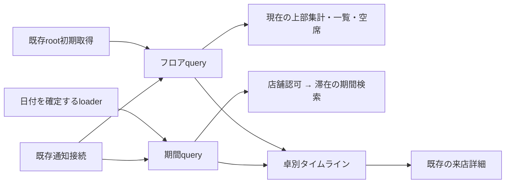

# 卓別タイムラインの調査と設計（#184）

[Issue #184](https://github.com/kit-codex-hack-fes-2026/tablecast-poc/issues/184) · [UI仕様](ui.md) · [テスト戦略](testing.md)

## 状態と範囲

2026-09-15の調査・設計案。実装、実DBでの性能測定、ブラウザー検証は未実施であり、受入条件の達成を示す文書ではない。

- 調査基点: `origin/staging` / `1c93135d51132253264824136f340734da4307fd`。
- branch: `codex/184-floor-timeline`。専用worktree: `/private/tmp/tablecast-184-floor-timeline`。
- 担当: `kouichi310`。着手時点で対応branch・PRはなく、ProjectをIn progressへ変更した。Priorityは組織Issue FieldのMediumを維持する。
- #165 / [PR #171](https://github.com/kit-codex-hack-fes-2026/tablecast-poc/pull/171)の統合commit `17798ec`が基点に含まれることを確認した。
- 今回は既存一覧に日単位の滞在表示を追加する設計まで。予約、時間のドラッグ編集、過去状態の推測復元は含まない。

## 調査結果

| 対象                                                                                                                 | 確認した実装                                                                                     | 設計への影響                                                                |
| -------------------------------------------------------------------------------------------------------------------- | ------------------------------------------------------------------------------------------------ | --------------------------------------------------------------------------- |
| [フロア](../apps/web/src/features/store/floor.tsx)・[一覧](../apps/web/src/features/store/table-timeline.tsx)        | 現在のTableTimelineはDataTable。稼働中の来店と空席、初回の優先順を表示する                       | 一覧を維持し、新しい時間軸部品をfeature内に追加する                         |
| [初期SSR](../apps/web/src/routes/__root.tsx)・[フロアloader](../apps/web/src/routes/admin.stores.$storeId.floor.tsx) | rootが認証・店舗一覧・フロアを取得してQueryClientへ設定し、子loaderが同じqueryを利用する         | rootの先読みを重複させない。日付と初期時刻をloaderから引き継ぐ              |
| [店舗状態](../apps/api/src/modules/stores/queries.ts)                                                                | cursorを先頭とする9文の1 batchで状態を取得。openかつkind=tableだけを返す                         | 現在の集計・状態・卓一覧を再利用する。卓ごとの詳細取得は追加しない          |
| [来店履歴](../apps/api/src/modules/tables/history.ts)                                                                | closedの来店をclosed_at降順でページングし、会計を集約する                                        | 任意日の重なり検索に流用しない。全履歴走査や会計の再取得を避ける            |
| [DB schema](../apps/api/src/db/business-schema.ts)・[migration](../apps/api/migrations/0013_tablecast_demo.sql)      | opened_at、closed_at、status、kind、table_idを保存。table_idはdemo用にnullable。時刻は整数ミリ秒 | 滞在は保存済み時刻から描く。demoは除外。卓と来店を別のIDとして扱う          |
| [店舗認可](../apps/api/src/modules/auth/middleware.ts)・[route組立て](../apps/api/src/modules/stores/routes.ts)      | requireStoreでセッションと店舗所属を検証                                                         | 新APIも同じmiddleware配下に置き、queryにもactor.storeIdを指定する           |
| [日時整形](../apps/web/src/i18n/format.ts)                                                                           | 日英ともAsia/Tokyo固定。storesにタイムゾーン列はない                                             | 現行PoCの店舗時刻をAsia/Tokyoと明記する案。任意タイムゾーン対応とは区別する |
| [リアルタイム](../apps/web/src/lib/use-realtime.ts)・[query](../apps/web/src/features/store/store-query.ts)          | WebSocket通知後にcursor差分を取得。再接続・pollで回復し、フロアは30秒でも再取得する              | 通知接続は一つを維持し、同じ通知で期間queryも無効化する                     |
| [詳細画面](../apps/web/src/features/store/table-detail.tsx)                                                          | 閉卓済みは支払・注文処理・呼出解除・閉卓操作を隠す                                               | 既存のvisit routeへsessionIdで遷移する                                      |

会計待ちの現行定義は`billRequested && bill.due > 0`、店員呼出は`staffCalled`、音声異常は`voiceState === "error"`。会計要求はイベントの存在から判定する。閉卓はvoice_stateをstoppedへ変えるため、保存された現在状態から過去の音声異常区間は復元できない。

## 採用する構成

既存フロアqueryを現在状態の正本として維持し、期間内の滞在だけを返す読取APIを追加する。新規依存、業務書込み、イベント種別は追加しない。



期間queryは滞在の位置を所有し、現在状態queryは注意表示を所有する。両者をsessionIdで対応付ける。別HTTP間の原子的なsnapshotを保証する構成ではないため、片方にしかない来店を即座に閉卓・空席と断定しない。

### 画面と操作

```text
フロアの様子                                      更新を受信中
[稼働卓] [要対応] [会計待ち] [音声異常]   ← 常に現在の集計
[一覧 / タイムライン] [卓を検索]
[前日] [2026-09-15] [翌日] [現在時刻へ]   日本時間
卓名             10:00      11:00      12:00      13:00
T01              [ 2名・閉卓 ]        [ 4名・利用中 →│]
T02              ← 前日から継続 [店員呼出]          │
T03  現在は空席  この日の来店なし                   │
                                                   現在
```

- 初期表示は既存の一覧。切替は既存Tabsを利用し、URLの`view=list|timeline`で再現する。日付は`date=YYYY-MM-DD`。一覧では日付操作を隠し、再度タイムラインへ戻った際に選択日を保つ。
- 24時間を横方向にスクロールする一つの領域へ置く。卓名列は左、時刻目盛は上へstickyで固定する。時刻列と各行の横スクロールを別々に実装しない。
- 当日の初回だけ現在時刻付近へ移動する。別日の初回は最初の来店付近、来店なしなら00:00を表示する。再取得では位置を変更しない。
- 行順は卓名とtableIdで安定させ、注意状態や来店追加で入れ替えない。上部集計には現在の状況と明示し、過去日の集計と誤認させない。
- 帯はsessionIdをkeyとした操作要素にする。人数、開始・終了、利用中／閉卓済み、日跨ぎを文字・記号で示す。現在状態は今日を表示中のopen来店だけに重ね、複数の注意状態を併記する。
- 過去日を表示中は、現在もopenの来店であっても現在の呼出・音声異常を過去の帯へ重ねない。過去イベントの時刻は既存詳細のログで確認する。
- 短い帯を実時間以上に拡大して滞在時間を誤表示しない。各卓に来店一覧を展開する操作を置き、時刻順の44px以上のリンクで全来店を選べるようにする。密集する帯のヒット領域を重ねず、短い滞在・同時刻・ゼロ時間もこの一覧で個別選択できる。
- 現在空席の卓は卓名欄から既存の開卓画面へ進める。過去日の空白を現在の空席と扱わない。過去日では誤操作を避けるため開卓導線を隠し、現在時刻へ戻って操作する。
- Tabで日付・切替・卓別来店・帯へ移動できる。スクロール領域には名称とfocusを与え、標準のキーボード／タッチ操作を使う。独自ARIA gridやドラッグ・キーボード移動体系は作らない。
- 日付切替、通知、時計による帯の伸長は即時反映する。装飾のために行や帯をアニメーションさせない。色だけに依存せず、支援技術向け名称にも卓名・時刻・状態を含める。
- 新規文言は既存Paraglideの日英メッセージに追加する。英語でも日本時間・JPYを維持する。

## 日付と滞在の契約案

初版は現行表示に合わせて店舗時刻をAsia/Tokyoとする。APIの公開schema入口から定数を共有し、ブラウザーのOSタイムゾーンや表示言語で日付が変わらないようにする。店舗ごとの選択機能や夏時間対応を実装済みとは扱わない。

- 表示期間は店舗日の`[startAt, endAt)`。例: 2026-09-15はUTCの2026-09-14 15:00以上、2026-09-15 15:00未満。
- 通常の滞在は`openedAt < endAt && (closedAt == null || closedAt > startAt)`で重なりを判定する。日頭ちょうどに閉卓した来店は当日に含めず、日末ちょうどに開卓した来店は翌日に含める。
- openはリクエスト開始時に固定した現在時刻までの実滞在との重なりも確認する。未来日には含めず、当日に開卓した瞬間は時刻0の来店として一覧に含める。取得時刻は`observedAt`として返す。
- `openedAt === closedAt`は滞在時間0の記録として、その時刻を含む日に限って取得する。面積を持つ帯は描かず、卓別来店一覧から選択できる。これにより境界上のゼロ時間も欠落させない。
- openの表示末尾は`min(now, endAt)`、closedは`min(closedAt, endAt)`。開始は`max(openedAt, startAt)`。未来日のopen来店を未来まで延ばさない。
- 表示範囲外の開始・終了には前日から／翌日へを示す。今日のopenには利用中、過去日の右端には翌日へ継続を示す。
- DBにはstatusとclosed_atの整合を完全に強制する制約がない。closedなのに終了時刻なし、終了が開始より前などは推測で補わず、既存エラー機構で取得不整合を通知して調査可能にする。履歴を黙って省略しない。

### SSRと時計

日付未指定の場合、loaderでフロアqueryの`dataUpdatedAt`から店舗日を一度確定し、選択日と初期現在時刻をloader結果としてserializeする。初回renderで別の`Date.now()`を呼ばない。指定日があればその日を使う。APIは返却するstartAt/endAtで実際の取得範囲を明示する。

hydration後は既存の分単位更新に合わせる。復帰時には現在時刻を同期するが、スクロールしない。日付を跨いでも選択日を自動変更せず、日付が変わった案内と現在時刻へ戻る操作を出す。現在時刻へは日付変更とスクロールを行う明示操作である。

## 期間API案

`GET /api/admin/stores/:storeId/timeline?date=2026-09-15&limit=100`

所有場所は`modules/tables`。`admin-routes.ts`で入力検証・既存店舗認可を経て、新設`timeline.ts`の読取関数を呼ぶ。schemaは同moduleの`model.ts`と既存`schema.ts`で公開し、WebはHono clientの推論型を使う。

| 入力                      | 意味                                                       |
| ------------------------- | ---------------------------------------------------------- |
| date                      | 必須の実在する店舗日。形式だけでなく2月30日等を拒否する    |
| limit                     | 既定100、1〜200の整数。上限はページ単位                    |
| beforeOpenedAt / beforeId | 両方指定か両方なし。opened_at DESC、id DESCのkeyset cursor |

出力案は`{ date, timeZone, startAt, endAt, observedAt, sessions, nextCursor }`。sessionは`id, tableId, guestCount, status, openedAt, closedAt`に限定する。現在の卓名と全卓行はフロアqueryから使う。注文snapshot、カート、会計、イベント本文、音声ログを返さない。

- `actor.kind === staff`、`store_id === actor.storeId`、`kind === table`を必須にする。卓joinが必要な場合もstore_idとtable_idの両方を条件にする。
- 昇順／降順が変わるclosed_atをcursorに使わず、不変のopened_atとidで同時刻・閉卓更新を扱う。limit+1件で続きを判定し、offsetや全履歴走査を使わない。
- 期間は1日だけ。自由なtableId・statusフィルターは初版には追加しない。UIの卓検索は既存フロア全卓を絞る表示操作とし、期間取得はその日かつ実卓来店へ絞る。
- アプリ側の新しいDB呼出しは1ページ1回のselectを目標にする。認証セッション取得・所属joinは別途必要で、HTTP全体が1往復になるとは説明しない。
- 通常の条件とcursorはDrizzleの`and/or/eq/lt/gt`、射影・並び・limitで表現できるため、生SQLや直接prepareは新設しない。

### indexと測定が残る部分

既存の`tablecast_sessions_closed_history`は`(store_id, closed_at DESC, id DESC) WHERE status='closed'`。open専用unique indexはtable_id先頭で、期間検索用ではない。現行indexだけで全日の検索が十分に速いとは断定できない。

実装時に、単一の重なり条件と、open／closedの検索をDrizzleのset operationで分ける案を同じfixtureで比較する。候補は実卓用の`(store_id, opened_at DESC, id DESC)` partial indexだが、片方の区間端だけでは全ての分布を効率化できない。古い日・直近日・日跨ぎ長期滞在・来店なしを測り、必要なindexだけ採用する。migration番号は統合担当と調整し、この設計作業では予約・生成しない。

採用済み[Drizzle 0.45.2](../apps/api/package.json)の型と生成SQLで確認する。[公式のselect](https://orm.drizzle.team/docs/select)は部分列取得・条件・並び・limitを提供し、[batch](https://orm.drizzle.team/docs/batch-api)はD1に対応する。公式資料のv1用APIを0.45.2へそのまま転記しない。

## query・更新・失敗

- `timelineOptions(storeId, date)`を既存の`infiniteQueryOptions`に合わせて追加する。keyは`["tablecast-floor-timeline", storeId, date]`。一覧では期間queryを購読・取得しない。
- タイムラインのloaderは最初の1ページを取得する。既存rootによるフロア取得後なので、初回timelineには追加HTTPと認証処理が生じる。まずこの追加費用を測り、#171の初期取得集約API拡張は測定で必要になった場合に絞って検討する。
- 取得済みページだけを表示し、続きを読み込む・読み込み中・続きの取得失敗を区別する。nextCursorがある間は部分表示と常に明示し、未取得の行を来店なしと断定しない。全ページ自動巡回やページを捨てるmaxPagesは使わない。
- 既存通知のcallbackでフロアと当該店舗の期間queryを無効化する。activeな期間だけ再取得し、非表示queryはstaleにする。追加のWebSocketやイベント履歴の描画取得は作らない。
- [TanStack Queryのinfinite query](https://tanstack.com/query/latest/docs/framework/react/guides/infinite-queries)は再取得を先頭から行う。読込済みページ数に応じてHTTPが増えるので、1回の通知が常に1HTTPとは見積もらない。cursorの変化と重複排除はsessionIdで確認する。
- next page取得と背景再取得を重ねない。通信中は続きの操作を無効化する。ページ取得の途中でopenがclosedになっても、次の再取得で期間内の記録へ収束することを試験する。
- 期間取得中に新規開卓の通知が来る場合も、フロアの既存cursorを起点に回復する。queryFnはAbortSignalを受け、店舗・日付を変えた後に古い結果を別keyへ流用しない。
- 初回失敗は読込失敗と再試行を表示する。再取得失敗では同じ日付の帯とfocusを維持し、更新失敗・取得時刻を表示する。別日の前データを新しい日付の帯として表示しない。
- フロアと期間のstatusが食い違う間は注意表示を確定しない。更新中／最終取得時点の表示であると示し、現在空席の判定はフロアだけを使う。開卓・詳細操作の最終判断は既存APIに任せる。
- 期間側のtableIdがフロアの全卓集合にない場合は取得不整合として再取得・エラーを表示する。卓名を捏造したり、該当の来店を黙って落としたりしない。
- scroll containerのDOMと行・帯のkeyを維持する。通知でscrollIntoViewやfocusを呼ばない。日付／表示切替時の横位置はページ内で保持し、詳細から戻る経路ではRouterの既存scroll restoration設定を確認して適用する。

## 実装順と検証設計

1. 日付境界・ゼロ時間・現在状態の表示条件を確定し、同Issueの受入条件へ具体例を追記する。
2. 期間schemaとAPI、実D1試験を追加する。大量履歴の測定でindexを決める。
3. Webの期間query・loader・表示切替・時間軸を追加する。既存一覧は名前の整理が必要な範囲だけ変更する。
4. 日英Story、実providerのBrowser試験、代表E2Eを実施し、UI仕様と受入条件を更新する。
5. 同じbranchのDraft PRへ実装差分・対象SHA・検証・PC/iPadの画面証拠を集約する。

| 保証             | 層とケース                                                                                                                                                                                                |
| ---------------- | --------------------------------------------------------------------------------------------------------------------------------------------------------------------------------------------------------- |
| 日付・位置計算   | API/WebのVitest。日頭・日末、前日から継続、翌日閉卓、openの現在時刻clip、ゼロ時間、うるう日、不正日付、ブラウザーが別timezoneでも同じ表示日                                                               |
| 店舗境界と完全性 | Cloudflare Vitest＋実D1＋HTTP。未ログイン、非所属、device、同店舗member、別店舗、demo除外。同卓の複数回来店、同opened_atのcursor、limit+1、全ページ集合一致、closed_at欠損                                |
| 取得中の更新     | 実D1の明示barrierで新規開卓・閉卓と読取を交差させる。初回snapshotの後に通知で回復し、日境界とページ境界で重複／欠落が残らないこと                                                                         |
| 負荷             | 1／100卓、100／10,000履歴、直近日／古い日／空の日／長期滞在、200件超の当日来店。measuredDatabaseでHTTP全体の往復とbindingMsを記録し、実SQL時間・読取行数・JSON bytes・返却内容を併記。各3標本を採る       |
| 性能予算         | 同じページ上限で卓・履歴件数を増やしてもDB往復が件数比例しないこと、返却は最大200件＋cursorであることを公開結果とともに保証する。時間・読取行数の数値予算は実D1の基準測定で決め、超過を予算緩和で隠さない |
| 画面             | Storybookで日英、PC、iPad縦横、全空席、卓0件、過去日、日跨ぎ、短い連続来店、全注意状態、続きありを固定時刻で再現する                                                                                      |
| 操作・cache      | Vitest Browserの実Floor・QueryClient・Routerで切替、日付移動、当日復帰、キーボード、タッチ相当、通知後のscrollLeft／focus／対象維持、初回・再取得・続きの失敗、店舗切替と遅延応答、日付跨ぎを確認する     |
| 最終配線         | Playwright＋実Web/API/DBでtimeline URLのSSR、hydration警告なし、稼働中／閉卓済み詳細への遷移、閉卓済みの読取専用、空席から開卓、戻る操作をChromium/WebKitで確認する                                       |

既存の[フロアfocus試験](../apps/web/src/features/store/floor.browser.test.tsx)、[履歴試験](../apps/api/test/history.test.ts)、[初期取得性能試験](../apps/api/test/initial-performance.test.ts)を維持する。実装時はAPI/Webのlint・型、変更ファイルのOxfmt、該当Vitest／Browser／E2Eを実行する。実iPadの操作感はブラウザーの寸法エミュレーションと区別して記録する。

## 残る判断と再開地点

- Asia/Tokyo固定は既存実装に合わせた初版案。任意の店舗タイムゾーンが必要なら、店舗設定・保存・DSTの日付境界を含む契約を実装前に再設計する。
- indexの採否、古い日検索の費用、初回timelineの追加HTTP、読込済みページ再取得の費用は未測定。API実装の最初に確認する。
- 短い来店を卓別リストでも選ぶ案はiPadで検証して確定する。帯を時間に反して拡大する案は採用しない。
- 本文のAPI名・schema名・ページ上限は提案値。外部公開済みの契約ではない。
- この文書を起点に同branchで実装できる。調査・設計の終了でIssueを閉じず、実装の受入条件は未達として保持する。

## この作業で行った検証

- この文書のOxfmtとローカル参照先20件の存在確認が成功した。アプリ・DB・lockfileの変更はない。
- `bun install --frozen-lockfile`は初回にminiflareの展開で失敗した。自分のworktreeに所属する導入プロセスを停止し、専用cache `/private/tmp/tablecast-184-bun-cache`と`--backend copyfile`で再実行して成功した。通常のprepare経由でLefthookを導入した。
- 開発サーバー、Compose、音声接続は起動していない。実D1、アプリの型・lint・テスト、実機検証は設計文書だけの変更なので実施していない。
- 判断の要約は[Issueコメント](https://github.com/kit-codex-hack-fes-2026/tablecast-poc/issues/184#issuecomment-5671820663)へ保存した。詳細文書は専用branchのローカル成果として保持し、push・PR作成は今後の作業とする。
