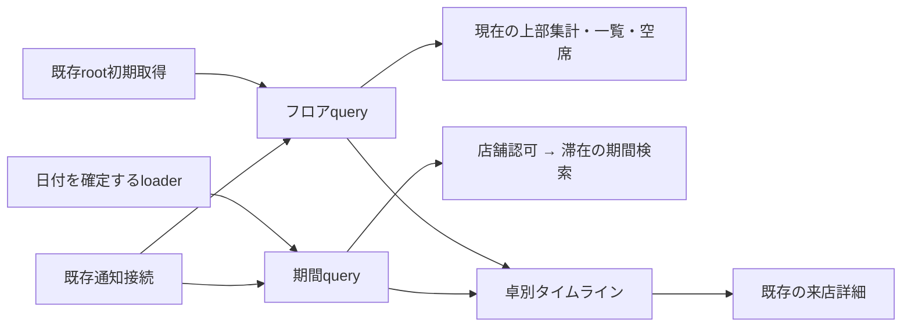

# 卓別タイムラインの調査と設計（#184）

[Issue #184](https://github.com/kit-codex-hack-fes-2026/tablecast-poc/issues/184) · [UI仕様](ui.md) · [テスト戦略](testing.md)

## 状態と範囲

2026-09-15の調査を基にした実装設計。検証の対象commit・実行結果・画面証拠は対応PRへ集約する。

- 調査基点: `origin/staging` / `1c93135d51132253264824136f340734da4307fd`。
- branch: `codex/184-floor-timeline`。専用worktree: `/private/tmp/tablecast-184-floor-timeline`。
- 担当: `kouichi310`。着手時点で対応branch・PRはなく、ProjectをIn progressへ変更した。Priorityは組織Issue FieldのMediumを維持する。
- #165 / [PR #171](https://github.com/kit-codex-hack-fes-2026/tablecast-poc/pull/171)の統合commit `17798ec`が基点に含まれることを確認した。
- 実装基点: 最新の`origin/staging` / `5c16b5e`へrebaseした。既存一覧に日単位の滞在表示を追加する。予約、時間のドラッグ編集、過去状態の推測復元は含まない。

## 調査結果

| 対象                                                                                                                 | 確認した実装                                                                                     | 設計への影響                                                              |
| -------------------------------------------------------------------------------------------------------------------- | ------------------------------------------------------------------------------------------------ | ------------------------------------------------------------------------- |
| [フロア](../apps/web/src/features/store/floor.tsx)・[一覧](../apps/web/src/features/store/table-timeline.tsx)        | 現在のTableTimelineはDataTable。稼働中の来店と空席、初回の優先順を表示する                       | 一覧を維持し、新しい時間軸部品をfeature内に追加する                       |
| [初期SSR](../apps/web/src/routes/__root.tsx)・[フロアloader](../apps/web/src/routes/admin.stores.$storeId.floor.tsx) | rootが認証・店舗一覧・フロアを取得してQueryClientへ設定し、子loaderが同じqueryを利用する         | rootの先読みを重複させない。日付と初期時刻をloaderから引き継ぐ            |
| [店舗状態](../apps/api/src/modules/stores/queries.ts)                                                                | cursorを先頭とする9文の1 batchで状態を取得。openかつkind=tableだけを返す                         | 現在の集計・状態・卓一覧を再利用する。卓ごとの詳細取得は追加しない        |
| [来店履歴](../apps/api/src/modules/tables/history.ts)                                                                | closedの来店をclosed_at降順でページングし、会計を集約する                                        | 任意日の重なり検索に流用しない。全履歴走査や会計の再取得を避ける          |
| [DB schema](../apps/api/src/db/business-schema.ts)・[migration](../apps/api/migrations/0013_tablecast_demo.sql)      | opened_at、closed_at、status、kind、table_idを保存。table_idはdemo用にnullable。時刻は整数ミリ秒 | 滞在は保存済み時刻から描く。demoは除外。卓と来店を別のIDとして扱う        |
| [店舗認可](../apps/api/src/modules/auth/middleware.ts)・[route組立て](../apps/api/src/modules/stores/routes.ts)      | requireStoreでセッションと店舗所属を検証                                                         | 新APIも同じmiddleware配下に置き、queryにもactor.storeIdを指定する         |
| [日時整形](../apps/web/src/i18n/format.ts)                                                                           | 日英ともAsia/Tokyo固定。storesにタイムゾーン列はない                                             | 現行PoCの店舗時刻をAsia/Tokyoと明記する。任意タイムゾーン対応とは区別する |
| [リアルタイム](../apps/web/src/lib/use-realtime.ts)・[query](../apps/web/src/features/store/store-query.ts)          | WebSocket通知後にcursor差分を取得。再接続・pollで回復し、フロアは30秒でも再取得する              | 通知接続は一つを維持し、同じ通知で期間queryも無効化する                   |
| [詳細画面](../apps/web/src/features/store/table-detail.tsx)                                                          | 閉卓済みは支払・注文処理・呼出解除・閉卓操作を隠す                                               | 既存のvisit routeへsessionIdで遷移する                                    |

会計待ちの現行定義は`billRequested && bill.due > 0`、店員呼出は`staffCalled`、音声異常は`voiceState === "error"`。会計要求はイベントの存在から判定する。閉卓はvoice_stateをstoppedへ変えるため、保存された現在状態から過去の音声異常区間は復元できない。

## 採用する構成

既存フロアqueryを現在状態の正本として維持し、期間内の滞在だけを返す読取APIを追加する。新規依存、業務書込み、イベント種別は追加しない。



期間queryは滞在の位置を所有し、現在状態queryは注意表示を所有する。両者をsessionIdで対応付ける。別HTTP間の原子的なsnapshotを保証する構成ではないため、片方にしかない来店を即座に閉卓・空席と断定しない。

### 画面と操作

```text
フロアの様子                                      更新を受信中
[稼働卓] [要対応] [会計待ち] [音声異常]   ← 常に現在の集計
[一覧 / タイムライン] [卓を検索]
[前日] [2026-09-15] [翌日] [現在時刻へ]   日本時間
卓名             10:00      11:00      12:00      13:00
T01              [ 2名・閉卓 ]        [ 4名・利用中 →│]
T02              ← 前日から継続 [店員呼出]          │
T03  現在は空席  この日の来店なし                   │
                                                   現在
```

- 初期表示は既存の一覧。切替は既存Tabsを利用し、URLの`view=list|timeline`で再現する。日付は`date=YYYY-MM-DD`。一覧では日付操作を隠し、再度タイムラインへ戻った際に選択日を保つ。
- 24時間を横方向にスクロールする一つの領域へ置く。卓名列は左、時刻目盛は上へstickyで固定する。時刻列と各行の横スクロールを別々に実装しない。
- 当日の初回だけ現在時刻付近へ移動する。別日の初回は最初の来店付近、来店なしなら00:00を表示する。再取得では位置を変更しない。
- 行順は卓名とtableIdで安定させ、注意状態や来店追加で入れ替えない。上部集計には現在の状況と明示し、過去日の集計と誤認させない。
- 帯はsessionIdをkeyとした操作要素にする。人数、開始・終了、利用中／閉卓済み、日跨ぎを文字・記号で示す。現在状態は今日を表示中のopen来店だけに重ね、複数の注意状態を併記する。
- 過去日を表示中は、現在もopenの来店であっても現在の呼出・音声異常を過去の帯へ重ねない。過去イベントの時刻は既存詳細のログで確認する。
- 短い帯を実時間以上に拡大して滞在時間を誤表示しない。共通の来店一覧を展開すると卓ごとに表示し、時刻順の44px以上のリンクで全来店を選べるようにする。密集する帯のヒット領域を重ねず、短い滞在・同時刻・ゼロ時間もこの一覧で個別選択できる。
- 現在空席の卓は卓名欄から既存の開卓画面へ進める。過去日の空白を現在の空席と扱わない。過去日では誤操作を避けるため開卓導線を隠し、現在時刻へ戻って操作する。
- Tabで日付・切替・卓別来店・帯へ移動できる。スクロール領域には名称とfocusを与え、標準のキーボード／タッチ操作を使う。独自ARIA gridやドラッグ・キーボード移動体系は作らない。
- 日付切替、通知、時計による帯の伸長は即時反映する。装飾のために行や帯をアニメーションさせない。色だけに依存せず、支援技術向け名称にも卓名・時刻・状態を含める。
- 新規文言は既存Paraglideの日英メッセージに追加する。英語でも日本時間・JPYを維持する。

## 日付と滞在の契約

初版は現行表示に合わせて店舗時刻をAsia/Tokyoとする。APIの公開schema入口から定数を共有し、ブラウザーのOSタイムゾーンや表示言語で日付が変わらないようにする。店舗ごとの選択機能や夏時間対応を実装済みとは扱わない。

- 表示期間は店舗日の`[startAt, endAt)`。例: 2026-09-15はUTCの2026-09-14 15:00以上、2026-09-15 15:00未満。
- 通常の滞在は`openedAt < endAt && (closedAt == null || closedAt > startAt)`で重なりを判定する。日頭ちょうどに閉卓した来店は当日に含めず、日末ちょうどに開卓した来店は翌日に含める。
- openはリクエスト開始時に固定した現在時刻までの実滞在との重なりも確認する。未来日には含めず、当日に開卓した瞬間は時刻0の来店として一覧に含める。取得時刻は`observedAt`として返す。
- `openedAt === closedAt`は滞在時間0の記録として、その時刻を含む日に限って取得する。面積を持つ帯は描かず、卓別来店一覧から選択できる。これにより境界上のゼロ時間も欠落させない。
- openの表示末尾は`min(now, endAt)`、closedは`min(closedAt, endAt)`。開始は`max(openedAt, startAt)`。未来日のopen来店を未来まで延ばさない。
- 表示範囲外の開始・終了には前日から／翌日へを示す。今日のopenには利用中、過去日の右端には翌日へ継続を示す。
- DBにはstatusとclosed_atの整合を完全に強制する制約がない。closedなのに終了時刻なし、終了が開始より前などは推測で補わず、既存エラー機構で取得不整合を通知して調査可能にする。履歴を黙って省略しない。

### SSRと時計

日付未指定の場合、loaderでフロアqueryの`dataUpdatedAt`から店舗日を一度確定し、選択日と初期現在時刻をloader結果としてserializeする。初回renderで別の`Date.now()`を呼ばない。指定日があればその日を使う。APIは返却するstartAt/endAtで実際の取得範囲を明示する。

hydration後は既存の分単位更新に合わせる。復帰時には現在時刻を同期するが、スクロールしない。日付を跨いでも選択日を自動変更せず、日付が変わった案内と現在時刻へ戻る操作を出す。現在時刻へは日付変更とスクロールを行う明示操作である。

## 期間API

`GET /api/admin/stores/:storeId/timeline?date=2026-09-15&limit=100`

所有場所は`modules/tables`。`admin-routes.ts`で入力検証・既存店舗認可を経て、既存`history.ts`に追加する読取関数を呼ぶ。schemaは同moduleの`model.ts`と既存`schema.ts`で公開し、WebはHono clientの推論型を使う。

| 入力                      | 意味                                                       |
| ------------------------- | ---------------------------------------------------------- |
| date                      | 必須の実在する店舗日。形式だけでなく2月30日等を拒否する    |
| limit                     | 既定100、1〜200の整数。上限はページ単位                    |
| beforeOpenedAt / beforeId | 両方指定か両方なし。opened_at DESC、id DESCのkeyset cursor |

出力は`{ date, timeZone, startAt, endAt, observedAt, sessions, nextCursor }`。sessionは`id, tableId, guestCount, status, openedAt, closedAt`に限定する。現在の卓名と全卓行はフロアqueryから使う。注文snapshot、カート、会計、イベント本文、音声ログを返さない。

- `actor.kind === staff`、`store_id === actor.storeId`、`kind === table`を必須にする。卓joinが必要な場合もstore_idとtable_idの両方を条件にする。
- 昇順／降順が変わるclosed_atをcursorに使わず、不変のopened_atとidで同時刻・閉卓更新を扱う。limit+1件で続きを判定し、offsetや全履歴走査を使わない。
- 期間は1日だけ。自由なtableId・statusフィルターは初版には追加しない。UIの卓検索は既存フロア全卓を絞る表示操作とし、期間取得はその日かつ実卓来店へ絞る。
- アプリ側の新しいDB呼出しは1ページ1回のselectを目標にする。認証セッション取得・所属joinは別途必要で、HTTP全体が1往復になるとは説明しない。
- 通常の条件とcursorはDrizzleの`and/or/eq/lt/gt`、射影・並び・limitで表現できるため、生SQLや直接prepareは新設しない。

### indexとDB往復

閉卓済み来店の開始日・終了日と、両日が二分木で分かれる境界をVIRTUAL generated columnとして持ち、通常のSQLite indexを張る。日付対応表・trigger・アプリ側の索引更新は持たず、旧APIの書込件数と互換にする。元の来店・注文・価格等を変更しない。

- 日付は日本時間の整数日とし、終了は閉区間の最終日へ正規化する。深夜ちょうどの閉卓は翌日へ入れず、ゼロ時間は開始日だけへ入れる。負のtimestampは剰余を補正して切り下げる。
- 同じ日の来店は店舗・開始日の等値条件で取得する。開卓時刻・IDの行値cursorと同じ順のindexを使い、深いページの先頭走査を避ける。
- 日跨ぎは日を葉とする固定二分木の境界へ1回だけ所属させる。検索日の祖先は32個以下であり、その左側の境界では終了日>=検索日、右側では開始日<=検索日をindex条件とする。この両端条件に一致する来店は実際に当日と重なるため、長期滞在によって別日の通常来店を検索しない。
- 開始日・終了日に2^31日を加え、APIのsafe integer timestamp全域を32 bitの非負の日に収める。境界値は二分木の分岐位置の2倍-1、同日では日付の2倍とする。開始日と終了日で最上位の異なるbitを選ぶため、各来店が複数の祖先へ重複所属することはない。
- 空の祖先探索は店舗の境界最小・最大値で除外する。両端はindexの先頭から1件ずつ取り、32個の候補をSQLiteのjson_eachへ渡して同じSQL内で絞る。全件MIN/MAX集約や別DB往復は追加しない。

同日・日跨ぎの左右・利用中の検索をDrizzleのUNION ALLで統合し、不変cursor順でlimit+1件へ絞る。不正な閉卓時刻は専用の式indexで検出して409を返す。正常取得と不整合検出はdb.batchの2文・1往復、認可込みHTTPは5文・4往復を維持する。長期滞在が当日に大量に一致する場合は、日跨ぎの並び替えがその一致件数に応じて増える。別日の履歴件数や最長滞在日数で通常来店の検索幅は増えない。

採用しなかった日付展開・trigger版はPR専用環境だけに適用され、staging/mainには未統合である。0017は番号を予約したno-opへ改め、新規環境に非互換なtriggerを作らない。0018_tablecast_timeline_interval_index.sqlは既存PR環境に残る派生表・triggerをIF EXISTSで回収してから、generated columnとindexを追加する。適用済みの0015・0016は維持する。0017の旧内容は移行試験のfixtureとして保存し、新規環境と旧PR環境の両方から同じschemaになることを確認する。

migration後も旧APIと同じ閉卓UPDATEのmeta.changesは1であり、営業書込みを止めず、通常のmigration→Worker配備の順で更新できる。追加列・indexを残してstaging/mainの既存アプリへ戻すこともできる。旧PR版44aa10cは削除済みの日付表を読むためrollback対象にはできない。PR #221の専用環境は52a952aへの配備成功で切替済みであり、この一時的な旧PR構造を使う環境は残っていない。元の来店データ・secret・依存・設定の移行は不要である。

実D1で前だけ・後だけ・前後双方に各100／10,000履歴を置いた空日・3来店日と、同じ大量履歴へ70日超の滞在を混ぜた1来店日・4来店日を各3標本測る。空日は38行、3来店日は41〜42行、長期滞在を混ぜた1来店日は43行・4来店日は47行で、履歴件数の増加によって変わらなかった。64読取行以内・4往復以内・1,000ms未満を返却内容と同じrequestで保証する。同日1万来店の深いcursorも10件取得で64読取行以内を確認する。通常の100卓・30件取得は4往復・4,576 bytesを維持する。

負の開卓時刻のcursorも応答と同じsafe integer範囲で受け付け、1970年以前の日を複数ページ取得するHTTP試験で確認する。二分木境界・1970年前後・未来日・safe integer全域を跨ぐ来店は、開始と終了の単純な重なり判定をoracleにして結果を照合する。generated columnを持たない既存DBと旧PRのtrigger版DBから移行し、元の履歴、旧APIの変更件数、閉卓・時刻更新・削除・外部キーを確認する。

[D1のgenerated column](https://developers.cloudflare.com/d1/reference/generated-columns/)と[SQLiteのjson_each](https://www.sqlite.org/json1.html#jeach)を使う。select・条件・subquery・union・batchはDrizzleで構築し、SQL断片はgenerated式、table-valued function、行値cursorに限定する。[D1 meta](https://developers.cloudflare.com/d1/worker-api/return-object/)の期間SQL時間・読取件数を、認可込みのHTTP・binding時間と分ける。remote D1の本番規模のindex作成時間・実ネットワーク遅延は未測定である。

## query・更新・失敗

- `timelineOptions(storeId, date)`を既存の`infiniteQueryOptions`に合わせて追加する。keyは`["tablecast-floor-timeline", storeId, date]`。一覧では期間queryを購読・取得しない。
- タイムラインのloaderは最初の1ページを取得する。既存rootによるフロア取得後なので、初回timelineには追加HTTPと認証処理が生じる。まずこの追加費用を測り、#171の初期取得集約API拡張は測定で必要になった場合に絞って検討する。
- 取得済みページだけを表示し、続きを読み込む・読み込み中・続きの取得失敗を区別する。nextCursorがある間は部分表示と常に明示し、未取得の行を来店なしと断定しない。全ページ自動巡回やページを捨てるmaxPagesは使わない。
- 既存通知のcallbackでフロアと当該店舗の期間queryを無効化する。activeな期間だけ再取得し、非表示queryはstaleにする。追加のWebSocketやイベント履歴の描画取得は作らない。
- [TanStack Queryのinfinite query](https://tanstack.com/query/latest/docs/framework/react/guides/infinite-queries)は再取得を先頭から行う。読込済みページ数に応じてHTTPが増えるので、1回の通知が常に1HTTPとは見積もらない。cursorの変化と重複排除はsessionIdで確認する。
- next page取得と背景再取得を重ねない。通信中は続きの操作を無効化する。ページ取得の途中でopenがclosedになっても、次の再取得で期間内の記録へ収束することを試験する。
- 期間取得中に新規開卓の通知が来る場合も、フロアの既存cursorを起点に回復する。queryFnはAbortSignalを受け、店舗・日付を変えた後に古い結果を別keyへ流用しない。
- 初回失敗は読込失敗と再試行を表示する。再取得失敗では同じ日付の帯とfocusを維持し、更新失敗・取得時刻を表示する。別日の前データを新しい日付の帯として表示しない。
- フロアと期間のstatusが食い違う間は注意表示を確定しない。更新中／最終取得時点の表示であると示し、現在空席の判定はフロアだけを使う。開卓・詳細操作の最終判断は既存APIに任せる。
- 期間側のtableIdがフロアの全卓集合にない場合は取得不整合として再取得・エラーを表示する。卓名を捏造したり、該当の来店を黙って落としたりしない。
- scroll containerのDOMと行・帯のkeyを維持する。通知でscrollIntoViewやfocusを呼ばない。日付／表示切替時の横位置はページ内で保持し、詳細から戻る経路ではRouterの既存scroll restoration設定を確認して適用する。

## 検証の割当て

| 保証             | 実装した検証                                                                                                                                                                 |
| ---------------- | ---------------------------------------------------------------------------------------------------------------------------------------------------------------------------- |
| 日付・滞在位置   | Web unitで店舗日・日付移動・clip・継続・ゼロ時間を確認。APIで日頭・日末・日跨ぎ・未来日・不正日付を確認                                                                      |
| 店舗境界と完全性 | Cloudflare Vitest＋実D1＋HTTPで未ログイン・非所属・device・同店舗member・他店舗・demo・所属取消を確認                                                                        |
| ページングと更新 | 同時刻の来店を全ページ巡回し、間に閉卓・新規開卓を実行して再取得後の集合を確認。終了時刻の欠損は409                                                                          |
| 負荷             | 100卓・100／10,000履歴の通常ページと、前・後・前後双方の履歴が各100／10,000件の空日・3来店の日を各3標本。HTTP往復・binding時間・SQL時間・読取行数・bytes・内容・cursorを測定 |
| 表示             | 日英、空席のみ、過去日、日跨ぎ、短時間、複数注意状態、部分取得の5 Storyを用意                                                                                                |
| 更新と失敗       | 実QueryClient・Router・CSSを使うBrowser試験で続きの503と再試行、背景再取得後の帯・focus・scrollLeftを確認                                                                    |
| 最終配線         | Playwright＋実Web/API/DBで日英×Chromium/WebKit。SSR、hydration、同卓の閉卓済み／利用中詳細、一覧切替、日付移動、当日復帰、戻る操作と空席の開卓を確認                         |

既存のフロアfocus、履歴、初期取得性能の試験を回帰対象とする。型・lint・formatはAPI/Webと変更文書を確認する。画像は既存UIの基点と実装後を1440×1000／1024×768で比較する。モデル呼出しや音声接続を使う検証ではない。

## 制約と追加確認

- Asia/Tokyo固定は既存PoCの契約。任意の店舗タイムゾーンには店舗設定とDSTの境界設計が必要になる。
- 初回タイムラインは既存フロア取得に加えて1 HTTPを使う。読込済みページの再取得はページ数分のHTTPを使う。全ページの自動巡回はしない。
- 長い帯だけが文字を収められる。狭い帯には時間以上の最小幅や文字を詰めず、時刻・人数・注意状態は展開一覧から確認・選択できる。
- 実iPad、VoiceOver、日付跨ぎの長時間連続稼働、remote D1の実SQL時間と読取行数は未確認。Chromium/WebKitと寸法の検証を実機の操作感の保証と混同しない。
- 初回／再取得失敗は既存ErrorNotice、店舗・日付の分離はQuery keyとAbortSignalに依拠する。これら全組合せの遅延通信試験は未実施。
- migrationはgenerated columnとindexを追加し、元の来店を変更しない。旧APIの閉卓件数と互換であり、通常の配備順を維持する。

調査時の判断は[Issueコメント](https://github.com/kit-codex-hack-fes-2026/tablecast-poc/issues/184#issuecomment-5671820663)に残す。以後の実装・検証・未確認範囲はPRを正本とする。
