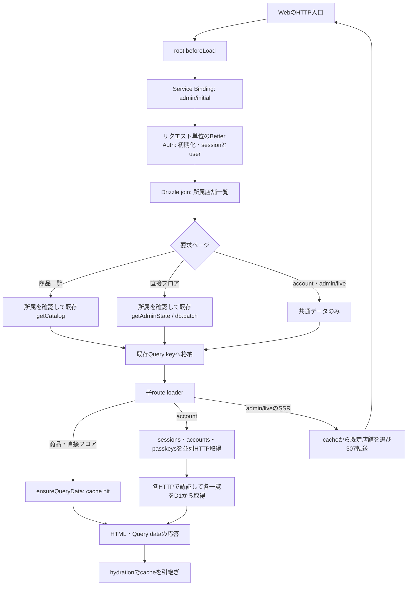

# SSR初期取得の調査と計測

[観測手順](observability.md) / [Issue #165](https://github.com/kit-codex-hack-fes-2026/tablecast-poc/issues/165)

2026-09-14にPR #171の一括取得を含むmainから調査した。最終比較のbaseは`0150bf6bd396c3b4774d48823d9da68e2117ead7`、変更後は本資料を含むPRの実装である。依存とDB schemaは変更していない。

## HTTP入口からHTMLまで

各SSRは`getRouter()`で専用のQueryClientを作る。rootの`beforeLoad`がレイアウトCookieを読み、Service Binding経由の`/api/admin/initial`を待ってセッション・店舗一覧をQuery cacheへ格納する。未認証なら子loaderへ進まずログインへ転送する。パネルCookieの読取りはローカル処理であり、HTTPやDB往復ではない。

- `/account`は共通データ取得後に3 HTTPを既に並列実行している。各認証はBetter Authの公開APIに任せる。独自session cacheや認証DBの直接参照へ置換しない。
- `/admin/live`のstores→sessionはcache hitで、追加HTTPではない。新規ドキュメント起動では307転送後、別のQueryClientで直接フロアを取得する。先行PRの初期APIは前段3往復＋転送先4往復。クライアントログイン後の既定フロア一括取得も保つ。
- 商品一覧は従来、共通初期取得3往復の後、catalog APIで認証初期化・session・所属・catalogの4往復を行っていた。`view=catalog`を追加し、所属店舗一覧から確認した店舗に限って既存`getCatalog`を呼ぶ。合計4往復になる。フロアは同時取得しない。
- cacheがあるクライアント遷移と、更新・再接続時のcatalog取得は従来のAPIと認可を使う。初期APIもHTTPごとに認証し、所属取消を反映する。
- `staleTime: 30_000`、SSRのCookie転送・Set-Cookie追記、`private, no-store`は維持する。Query cacheはWorker全体へ移さない。標準のSSR連携は[TanStack Query公式資料](https://tanstack.com/query/latest/docs/framework/react/guides/ssr)に従う。

## 比較条件と結果

macOS、Bun 1.3.13、Node 24.2.0、実local workerd/D1とChromiumで比較した。外部モデル呼出しとtoken使用は0。生の数値は[計測JSON](measurements/165-ssr.json)に保存した。

ブラウザーは同じURL、demo seed、スタッフ資格を使用した。seedは3店舗・各12卓で、商品一覧の対象こもれびは60商品である。各ページでWorkerを再起動し、最初の1回をcold、続く3回をwarmとした。coldはlocal Worker再起動直後の意味であり、Cloudflare公開環境のcold startではない。DB・Cookie・ブラウザーcacheは保持する。TTFBはNavigation Timingの`responseStart - startTime`、HTML受信完了は`responseEnd - startTime`、描画はFCP、操作確認はナビゲーションボタンのclick完了後までである。操作確認にはPlaywrightの待機時間を含む。

| 経路             | Worker              | TTFB 前→後 ms | HTML受信完了 前→後 ms | FCP 前→後 ms | 操作確認 前→後 ms |
| ---------------- | ------------------- | ------------- | --------------------- | ------------ | ----------------- |
| account          | cold・各1回         | 777.5→527.2   | 784.0→533.7           | 868→604      | 1127.7→772.7      |
| account          | warm・各3回の中央値 | 52.7→34.5     | 53.0→34.8             | 76→52        | 150.5→112.9       |
| admin/live→floor | cold・各1回         | 746.2→536.2   | 748.3→537.2           | 776→564      | 843.9→618.4       |
| admin/live→floor | warm・各3回の中央値 | 59.2→39.9     | 61.7→42.1             | 84→60        | 160.5→115.6       |
| 商品一覧         | cold・各1回         | 597.9→520.3   | 610.3→529.3           | 624→544      | 694.9→614.7       |
| 商品一覧         | warm・各3回の中央値 | 60.2→39.8     | 69.7→45.6             | 84→60        | 153.7→132.8       |

未変更のaccount・floorも短縮しており、マシン負荷やcacheの影響を除去できていない。表示時間の差すべてを本変更の効果とせず、この少数標本から時間予算を固定しない。

API試験では同一の実D1へ、本番Hono入口・middleware・認証・業務queryを接続し、従来の2 HTTPと一括取得の1 HTTPを各3回比較した。商品以外のfixtureを保ち、商品だけを1件から100件へ増やした。

| 商品数 | D1往復 前→後       | HTTP合計の中央値 前→後 ms | binding待ち合計の中央値 前→後 ms | 一括応答bytes |
| ------ | ------------------ | ------------------------- | -------------------------------- | ------------- |
| 1      | 7→4・各3回とも一定 | 8→4                       | 1→1                              | 1760          |
| 100    | 7→4・各3回とも一定 | 8→5                       | 3→1                              | 59864         |

binding待ちは実行メソッドを実D1へ委譲した外側の経過時間であり、SQL内部時間やネットワークRTTではない。local workerdの時計で0msになる標本もあり、細かな時間差の証拠にしない。Drizzleが使用するD1の`raw()`は結果行だけを返すため、この計測ではSQL内部時間のmetadataは取得できていない。

性能予算は変更対象の初期APIを4往復以内、catalog以外の応答増分を4000 bytes未満とした。全商品の価格・版・構成が従来APIと一致することを同時に検証する。商品数を増やしても往復は増えず、全件を表示するために必要なcatalogの返却量だけが増える。値の切捨てや性能予算の緩和は行っていない。

## 検証と残る範囲

- 実Workers/D1のAPI試験はinitial-state・initial-performance・auth・store-membership・voice-performanceの5ファイル、23件成功。未認証、別店舗、所属取消、セッション取消、更新Cookie、100商品での結果と性能予算を確認した。
- SSR E2EはChromium・WebKit各5件、計10件成功。各経路のcold/warm、hydration直後の重複取得なし、匿名との分離、JSなしのSSR、失敗後の再試行、ログイン・アカウント更新・PWA転送を確認した。
- API/Webのlint・型検査、変更ファイルの整形と差分検査を実施した。
- 公開環境の配備・同条件比較、SSRから各HTTPとD1を同一traceで結んだSQL内部時間の取得は未実施。公開環境の改善確認を含むIssue #165は、この部分修正だけでは閉じない。継続計測は#156、音声業務は#147の担当範囲を保つ。

再実行は`bun run --cwd apps/api test test/initial-performance.test.ts --reporter verbose`、`bun run --cwd apps/web test:e2e tablecast-ssr.spec.ts --workers 1`を使う。ブラウザーの各標本は`test-results`内の`ssr-performance.json`へ保存する。共通の計測fixtureは実D1を差し替えず、既存の音声性能試験と共有する。
