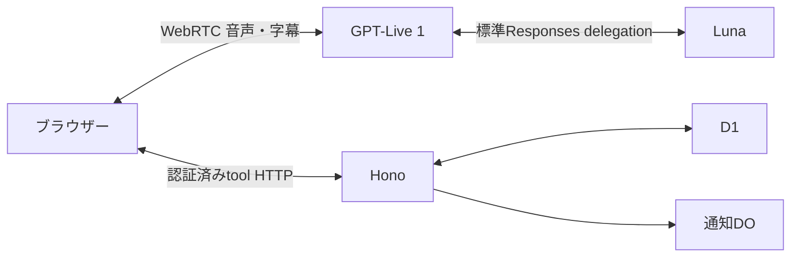

# GPT-Live・Responses delegation・Honoの接続

## 採用構成

ブラウザーからGPT-Live 1へ標準WebRTCで接続する。GPT-Liveの標準Responses delegationにgpt-5.6-lunaを設定し、接続・会話文脈・推論の継続をOpenAIへ任せる。Mastra、LiveKit、hosted Agents API、独自STTは利用しない。

公式OpenAI SDKのLive session作成をHonoが行い、SDPだけをブラウザーへ返す。APIキーはサーバーだけが持つ。backendはLuna、reasoning none、verbosity low、priority、最大800出力tokenとする。独立したtoolはparallel_tool_callsを許可し、書込みや版に依存する操作は順序を保つ。

[公式Delegation仕様](https://developers.openai.com/api/docs/guides/live-delegation)

## ツールと出力

Liveのresponse.event内のresponse.createdでresponse IDを記録し、response.output_item.doneのfunction_callからcall_id・name・argumentsを収集する。response.completedのoutputは空配列になり得るため、その配列からtool有無を判断しない。必要な結果をresponse.item.createで全件返してからresponse.createで一度だけ継続する。

ブラウザーはHonoの認証済みtool経路へ転送する。価格計算、認可、注文・カート操作をブラウザーへ複製しない。業務の失敗はtool結果へ返し、音声接続を維持する。古い委任の遅着結果で次の委任を継続しない。

商品検索は最大8件とtotal/moreを返し、offsetで続きへ進む。商品紹介はgetCatalog(show=true)で検索と最大4枚のカード表示をまとめる。注文する商品を特定したら必要な詳細を取得する。ツール結果からGUIのイベント履歴・二言語の注文snapshotの重複を除き、価格・版・必須選択・認可の検査は維持する。

## 字幕・保存・停止

session.input_transcript.delta / session.output_transcript.deltaを受信時に表示する。字幕の表示順は追加後に入れ替えず、保存したD1履歴を再開時に復元する。強い会話履歴の整合性や字幕の到着を注文承認の証明にはしない。生音声は既定で保存しない。

注文はAPIの版付きsnapshotと、その案内後の明示承認を必要とする。同じ委任で確認準備と承認を行わず、APIも作成turnと異なる現行turnを検査する。委任IDは物理的な発話境界の証明ではない。停止・設定変更・カート変更は古い確認を無効化する。

停止はcapture・再生を即時終了し、APIで音声sessionを失効させ、Liveへsession.closeを送る。API側でも標準sideband接続でsession.closedを確認する。明示再開まで自動再接続しない。確定したカート・注文は停止で戻さない。

自発接客は180秒の無言と店舗設定、空カート、確認・スタッフ呼出・進行中turnの有無をAPIで検査する。参照専用turnで商品を取得し、一商品の事実をLiveへ渡す。客の発話や承認として保存しない。

## 観測と検証

HonoのHTTP、tablecast.voice.tool、D1と通知をGrafanaで追う。tool spanにツール名・call ID・voice session/turn・実行時間・結果byte数を記録する。OpenAI内部をアプリの計測で観測できた扱いにしない。

性能目標はツール受付→結果返却、利用者の発話終了→実返答音声開始の双方1秒以下。待機案内や字幕到着を実再生の代わりにしない。成功率・使用token・標本数と超過区間を残す。

実D1テストは認可・価格・版・同時実行・停止・別卓拒否を検証する。voice-performance.test.tsは商品数を増やし、実D1のSQL実行と保存されたカード表示を確認しながらbinding往復と出力サイズの予算を検証する。上限超過時は原因を調べ、閾値の緩和で成功扱いにしない。

Webの固定イベント試験は全tool結果の返却・一回の継続・エラー・新委任による取消・字幕・停止を検証する。実GPT-LiveとLunaは有料試験で、Inworld生成音声を使いlocalと同一SHAのPR previewで確認する。通常CIの固定イベントだけで実API・音声・1秒達成を証明した扱いにしない。
