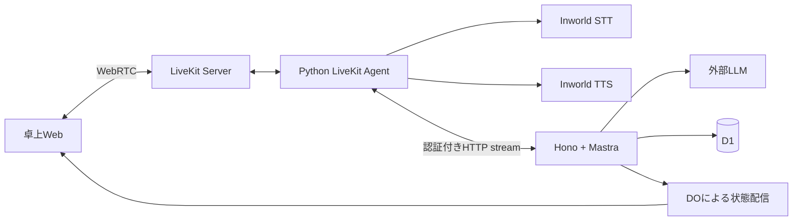

# Mastra・LiveKit・Honoの接続

[索引](../README.md) / [発話仕様](speech.md) / [上流パッチ](upstream-patch.md)

## 採用する経路

LiveKitは音声通信、VAD（発話区間検出）、ターン判定、barge-in（発話への割り込み）、STT/TTS接続を所有する。
Mastraは接客判断とツール実行、Honoは認証・業務状態・公開APIを所有する。Pythonに業務ツールやDBアクセスを複製しない。
Inworldへ直接つなぐ公式pluginを使う。LiveKit Inference経由の課金・プロキシをローカル構成の必須条件にしない。

## Pythonからの薄い接続

公式のPython版MastraLLMがあると仮定しない。LiveKitの公開 `llm_node` とMastraの `Agent.stream().textStream` を接続する。[S04](../sources.md#s04) [S07](../sources.md#s07)

1. Honoが端末権限を確認し、卓セッションと音声セッションを関連付け、LiveKit参加情報を発行する。
2. Python Agentが認証済みAPIから店舗・言語・キャスト設定を取得する。
3. LiveKitが確定した発話と実際の会話文脈を、PythonがHonoへ送る。
4. Hono内のMastraが同じTypeScriptの注文操作を呼ぶ。自Workerの公開URLへ再度HTTPを送らない。
5. 読み上げ本文だけを `text/plain; charset=utf-8` のstreamで返し、Pythonが公開nodeへyieldする。
6. LiveKitの公式Inworld pluginが合成・再生を担当する。

`POST /internal/voice/turns` は音声Agent専用tokenで認証する。少数の必要な入力はturn ID、voice session ID、応答言語、会話文脈、参考の話者情報とする。
店舗・卓の権限はtokenとDBで決め、本文のIDだけでは決めない。要求と応答のschemaはAPI側が所有する。
HTTPのchunkを文・文字の境界とみなさず、httpxの既存デコーダーとLiveKitの文分割を使用する。独自SSE形式、LLM実行ループ、全APIの別SDKを作らない。
Honoで認可したコンテキストを公式 `RequestContext` に設定し、公式 `Agent.stream` へ直接渡す。固定版 `@mastra/hono` 1.7.6のcontext middlewareは、未使用の管理route経由でNode用 `createRequire(import.meta.url)` をbundleへ含め、ビルド済みworkerdの起動に失敗したため採用しない。独自adapterを追加せず、公開プリミティブで同じ認可と業務操作を維持する。[S08](../sources.md#s08)

## 会話文脈とキャンセル

音声セッション中はLiveKitが保持する再生・中断を反映した文脈を正本とする。Mastraへ毎ターンその文脈を渡し、PoCではMastraの独立した会話自動保存を有効にしない。
D1の業務タイムラインは別の目的で保存する。全生成文を客が聞いた発話として保存しない。中断前に再生された部分を全削除もしない。
再生範囲はSDKの公開情報を使い、波形と文字位置を独自推定しない。確認できない範囲は中断・再生範囲不明として扱う。

barge-inはLiveKitの再生停止→Python HTTP取消→HonoのAbortSignal→Mastra取消へ伝える。投機的生成は初期無効とする。
**取消前にcommitしたカート変更や注文は消えない。** 古いturnの後続書込みを状態・版で拒否し、次のturnはDBを読み直す。
途中失敗を正常終了とみなさず、turnを完了・中断・失敗で記録する。状態不明の書込みを自動再実行しない。

## 明示停止・再開

UIの音声停止はbarge-inより強い操作である。停止状態は通常のネットワーク断と区別し、勝手に再接続しない。
初期実装ではLiveKitの音声Roomから退出し、ローカル音声トラックのcaptureを停止する。Agent側は参加者退出・セッション閉鎖でSTT・生成・TTSを終了する。
音声停止要求を受けたAPIはその音声セッションの新しいturnと古いturnの追加操作を拒否する。すでにcommitした操作は維持して画面へ表示する。
業務HTTP/DO接続、卓セッション、カート、確定ログは残す。再開は新しいvoice sessionで最新の業務状態と必要な確定ログだけを読み、未再生音声を再開しない。
停止後のブラウザーのマイク使用表示と、外部STTへ新たなframeが送られないことを実機確認する。

## 注文確認の独立した読上げ

APIが版付き注文スナップショットと固定読上げ文を生成する。通常のLLM応答に似た確認文があっても、それを確認対象と認めない。
Mastraの準備ツールは既存の業務状態に確認actionを作る。Pythonはそのactionを既存APIから受け、通常生成と二重再生しないよう一度だけ `session.say` 等の公開機能で読む。
最初から別のツール実行プロトコルを作らない。現在turnの終了時点と確認actionの受渡しを小さな接続試験で確定してから実装を広げる。
確認文は商品・選択肢の登録読上げ名と決定的な数値表現から生成し、自由な言換えや演技を加えない。
音声承認は読上げ完了後の新しい客発話が対象。途中訂正・明示停止・カート更新で以前の音声確認を失効させる。
GUI承認は表示済みの現行スナップショットに対する独立した承認経路とし、音声停止中も利用できる。

## STTと話者

Inworld公式pluginの公開importを維持し、必要な場合だけダイアライゼーション設定と結果変換をpatchする。[S01](../sources.md#s01) [S02](../sources.md#s02)
LiveKitのPython `MultiSpeakerAdapter` は上流の契約に合わせて利用する。能力フラグだけで互換性が証明されたと扱わない。
RMS（音声の実効振幅）による主話者候補は、注文者や最も近い客を保証しない。背景話者を一律削除しない。
同時発話を完全に分離できるわけではなく、曖昧さを検出できない場合もある。声の番号を個別会計・本人認証に使わない。
言語はja/enを明示し、SDKの英語既定値へ任せない。不要な年齢・性別等のvoice profilingは無効にする。

## TTS・字幕の境界

直接pluginではInworldネイティブの演技タグと休止指定を渡す。**LiveKit Expressive Modeは公式上Inference TTS向けであり、直接pluginで同じ自動処理が働くとは限らない。**[S03](../sources.md#s03) [S06](../sources.md#s06)
利用版に使える公開formatterがあれば再利用し、なければ公開 `transcription_node` に小さな生成文専用formatterを置く。声の合成、再生同期、STTを再実装しない。
生成文専用formatterは認める演技記法とbreakだけを扱い、分割chunk・中断・閉じ忘れでタグ断片を画面に流さない。全文の角括弧を消す正規表現を客発話・商品原文に適用しない。
感情JSONを待ってから発話する二重生成は不要。感情は自由文のまま、画面・店舗ログにはタグを除いた実際の発話テキストを使う。
この直接pluginと字幕整形の組合せは未検証であり、最初の音声ゲートで確認する。

## エコーとローカル条件

Agent入力は卓端末のマイクtrackだけとする。TTSはLiveKitのremote trackで一度だけ再生し、別Audio要素やWeb Audioの二重経路を作らない。
WebRTCのAEC（音響エコー除去）を有効にする。通常のTTS中はマイクを止めず、訂正を可能にする。明示的な音声停止だけは前節の通り止める。[S09](../sources.md#s09)
完全ローカルはローカルVAD＋AECが基準。Cloud専用の適応的割り込み・強化雑音抑制をローカルで必ず使えるとしない。
エコー除去は無誤認識の保証ではない。人が無言のままTTSが発話する試験、TTS中の訂正、大小の音量、iPad配置、複数人で検証する。
自己音声と文字一致する発話を全部捨てる仕組みは、客による復唱も捨てるため作らない。

## ログ

API、Mastra、Pythonに同じtable session ID、voice session ID、turn ID、request ID、release SHAを渡す。秘密情報をRoom名やログへ入れない。
ローカルは各プロセスの構造化ログ、業務履歴はD1。本番はWorkers Logsと利用可能なLiveKitの観測を併用する。
Mastra Studioを店舗ダッシュボードに転用せず、D1だけで全Mastraトレースが永続表示できるとも仮定しない。独自監視基盤を必須起動依存にしない。
