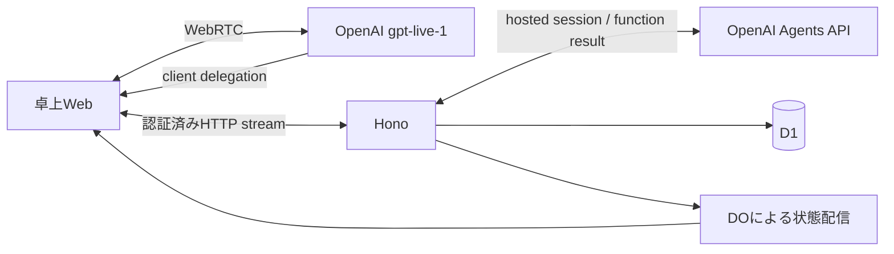

# GPT-Live・Agents API・Honoの接続

[索引](../README.md) / [発話仕様](speech.md)

## 採用する経路

ブラウザー標準のWebRTCでGPT-Liveへ直接接続する。Honoが公式OpenAI SDKの `live.create` へSDP offerを送り、SDP answerと音声session IDだけをブラウザーへ返す。APIキーはサーバーだけが持つ。通常音声は `gpt-live-1`、委任方式は `client` に固定する。

業務委任はhosted OpenAI Agents APIを `environment: { type: "none" }` で使う。公式JavaScript SDK `openai` 7.15.0の `beta.agents.sessions` を使い、Mastra・LiveKit Server・Python Agent・音声Containerを持たない。Agents SDKのローカルRunnerやResponses APIへの置換は行わない。

[OpenAI WebRTC](https://developers.openai.com/api/docs/guides/voice-webrtc?api=live) / [client delegation](https://developers.openai.com/api/docs/guides/live-delegation) / [Agents API](https://developers.openai.com/api/docs/guides/agents-api/quickstart)

## 委任と業務認可

1. Honoが店舗・卓・端末またはデモ所有者を認可し、GPT-Live sessionを作成する。
2. Webは `session.delegation.created` を受け、直近の会話と途中字幕を認証済みAPIへ渡す。字幕はモデルへ渡す参考文脈であり、店舗・卓・権限の根拠にしない。
3. HonoがD1へ業務turnを予約し、既存の業務操作で取得した現在の卓情報と参考履歴を渡してAgents sessionを作る。同じ卓情報をモデルのツール呼出しで取り直す待機を省き、更新操作は引き続き現在の版と認可を検証する。`TABLECAST_MODEL` は業務委任用で、音声モデルとは独立する。
4. Agents APIの `agent.session.requires_action` で要求されたfunctionだけを、既存APIの業務操作で実行する。`turn_id` と `call_id` を対応付け、結果を `agent.session.input.tool_result` で返す。GUI・MCPと価格・在庫・注文の正本を共有する。
5. Agents APIの `final_answer` の本文差分をSSEでWebへ渡す。Webはブラウザー標準の文分割で未完の末尾だけを保持し、完結した文から同じdelegation IDの `session.commentary.append` へ上限内で順次渡す。Agentsの進捗用 `commentary` や単語の途中は渡さない。GPT-Liveが結果を自然に説明する。最初の文を渡すために全文生成・SSE完了を待たない。

APIは現在の音声session、業務turn、卓、公開設定版と引数を検査する。字幕表示のまとまりを注文承認や新しい業務turnの根拠にしない。結果不明の変更要求を自動再送しない。SSEは本文の `delta` と終端の `completed` / `failed` を分ける。ツールの完了・失敗・中断は実行結果から記録し、HTTP streamが閉じただけで成功扱いにしない。失敗や完了通知のない切断ではWebが音声を停止し、未確認の結果を案内させない。GUIとカートは保持する。

文末記号のない末尾は `completed` で送信し、失敗・中断時は破棄する。未送信の本文もAPIと同じ16,000文字上限を持つ。[公式の委任ガイド](https://developers.openai.com/api/docs/guides/live-delegation#reduce-backend-latency)に従い、意味の通る結果を送るために必要な範囲だけ蓄積する。GPT-Liveは受け取った文を言い換えるため、送信済みや通信成功を商品名・金額を含む実発話の正しさと同一視しない。

Agents APIはHTTP切断後も処理が続き得るため、停止時には `agent.session.input.cancel` を明示送信する。cancelは現在の実行に作用するため、別の業務turnへ同じhosted sessionを使い回して古い取消を届かせない。[function tools](https://developers.openai.com/api/docs/guides/agents-api/tools/functions) / [session操作](https://developers.openai.com/api/docs/guides/agents-api/sessions)

初期inputの開始前にもsessionはidleになり得るため、idleだけでは停止済みと判断しない。イベント購読と正本のturn取得で初期root turnの開始を確認し、取消を一度送る。SSEの最初の通知までHTTP応答が来ない場合にも、既に開始したturnの取消送信を待たせない。root turnが終了済み、sessionがidle/failed、required_actionsが空の全条件で停止を確認し、購読を閉じる。通常の応答も対象root turnの完了後にsessionのidleを確認して完了通知を返し、EOFだけでは成功扱いにしない。

hosted sessionの作成応答より先に停止した場合、マイク・Live・業務資格は停止し、元の委任処理が遅れて届くsession IDを取得して取り消す。停止APIはこの間をHTTP202 Accepted、提供元の停止確認済みをHTTP200で区別する。両方とも既存の卓状態を返す。202の時点ではAgent生成の終了を証明していないため、実音声試験では保存されたprovider turnの終端も別途確認する。

## 会話履歴とログ

`session.input_transcript.delta` と `session.output_transcript.delta` を受信した時点でUIへ追記する。前後の空白を勝手に削らない。利用客・キャストを別に表示し、重なって話した場合にも本文を混ぜない。

GPT-Liveの字幕に確定発話IDはない。表示用のまとまりをアプリで扱い、字幕をまとめてAPIの会話ログへ保存する。永続化はtoken単位のD1書込みにしない。Agents内部回答を実際に発話した本文として二重保存せず、雑談もGPT-Live字幕から記録する。

再開時は同じ店舗・来店の最近の字幕を参考文脈として使う。履歴から過去の注文や承認を再実行せず、現在の注文・カートはツールで確認する。表示・生成文脈・実際に聞こえた範囲の厳密な一致は保証しない。生音声は既定保存しない。

APIの既存OTel/GrafanaとD1の業務イベントを維持する。hosted session IDとTableCastのvoice session・turn IDを対応付ける。OpenAIに保持されるモデル文脈と、TableCastの注文・監査記録は別の責務である。

## 注文確認と停止

注文はAPIが商品・選択肢・数量・合計・カート版・設定版・期限を含むスナップショットを作り、明示承認を検査する。GUIに表示した現行スナップショットの確認を維持する。GPT-Liveの字幕確定や再生完了は承認の証拠にしない。音声承認では同じvoice sessionの現行snapshotと、その作成後に開始した別の業務turnを検査する。自然言語の明示承認はモデルが判断し、別delegationを物理的な別発話の証明とは扱わない。表示用の字幕IDでこの条件を代用しない。カート・設定変更・音声停止で古い確認は無効になる。

UI停止はマイクcaptureと再生を即時終了し、APIが音声sessionを失効させ、Agents APIの実行とGPT-Live sessionを明示停止する。ブラウザーの切断だけに依存せず、API側からの停止にも公式Live制御を使う。明示再開まで勝手に再接続しない。停止前に確定したカート・注文はロールバックせず、GUI・卓・会計を維持する。

自発接客の可否と間隔、空カート、確認・スタッフ呼出・進行中turnの有無はAPIで検査する。自発turnは参照専用で、客発話として保存しない。

## 検証の境界

無課金のAPI試験は公式SDKのHTTPイベント境界と実D1を使い、function結果、失敗・取消、認可、重複要求と注文を検証する。Web試験は標準media APIの境界で字幕追記、許可待ちの停止、接続競合、古いイベントを検証する。

実GPT-Live・Agents APIは有料試験として通常CIから分離する。日英の合成入力音声、実WebRTC、ツール完了、字幕の途中表示、明示停止とカート保持をlocal・PR previewでそれぞれ確認する。入力をInworld TTSで生成しても製品の音声runtime依存にはしない。iPadのAEC・店内騒音・実マイク・自然な会話品質は別の受入とする。実施結果と対象SHAはIssue #100・PR #104へ記録し、この仕様だけで検証済みとは扱わない。
