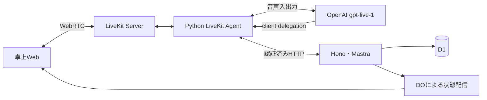

# Mastra・LiveKit・Honoの接続

[索引](../README.md) / [発話仕様](speech.md)

## 採用する経路

LiveKit公式OpenAI plugin 1.8.1の `GPTLiveModel(model="gpt-live-1", delegation="client")` を使う。GPT-Liveが音声理解・会話・音声生成・割り込みを担当し、業務判断は既存Mastraに委任する。Inworld TTS、独自WebSocket、Agents APIは追加しない。モデルにfunction toolsを直接渡す方式ではない。

[LiveKit GPT-Live plugin](https://docs.livekit.io/agents/models/realtime/plugins/gpt-live/) / [OpenAI client delegation](https://developers.openai.com/api/docs/guides/live-delegation)

## 委任と業務認可

1. Honoが店舗・卓・端末を認可し、限定されたLiveKit参加資格を発行する。
2. Pythonは `/internal/voice/config` と `/internal/voice/live` から音声・言語・接客指示・最近の会話を取得する。秘密鍵を応答に含めない。
3. 公開 `delegation_created` イベントの `pending_transcript` と最近の会話を `/internal/voice/turns` の `transport: live` へ渡す。委任時の本文量は直近8項目・各2,000文字と途中字幕2,000文字に制限する。
4. Mastraが既存の共通業務ツールを実行し、確認済みの結果と必要な質問を本文で返す。価格・在庫・権限・注文の正本はAPIとD1に置く。GUI・MCPと業務操作を共有し、Pythonに業務実装を複製しない。
5. Pythonが `Agent.duplex_session.append_commentary` で同じdelegation IDへ結果を返す。appendの500 tokens上限を超えないよう100文字ずつ渡す。GPT-Liveが自然な言葉で説明する。

LiveKitの発話開始イベントごとに業務turn IDを分け、一発話内の重複委任は受け付けない。新しい発話で進行中の委任を取り消し、古い結果を会話へ戻さない。変更結果が不明な要求を自動再送しない。APIは現在の音声session・turn・卓・設定版・引数を検査する。

既存のRealtime直接tool APIとcascade経路は回帰試験・既存内部クライアント用に残す。通常RoomはGPT-Liveだけを起動し、自動fallbackしない。固定読上げを必要とする旧クライアントの音声承認手順は互換対象にしない。

## 会話履歴とログ

`conversation_item_added` の利用客・Agent字幕を、委任のない雑談も含めて `/internal/voice/conversation` へ保存する。SDK item IDで重複通知を抑える。Mastraの内部回答を発話済み本文として二重保存しない。音声話者番号や本人を推測しない。

再開時は同じ店舗・来店の直近40項目・本文合計2,000文字以内を公開 `ChatContext` へ渡す。履歴は参考文脈であり、過去の依頼や注文承認を再実行しない。現在の注文・カートはツールで確認する。

SDK字幕には遅延・欠落・中断があり得る。生成した文、モデル文脈、利用客が聞いた部分の厳密な一致は保証しない。独自の再生範囲照合、文脈修復、永続記憶基盤は作らない。生音声は既定保存しない。API・Mastraの既存OTel/Grafanaを再利用する。

## 音声確認とGUI確認

APIが商品・選択肢・数量・合計・カート版・設定版・期限を含むスナップショットを作る。Mastraは `prepareConfirmation` の後も本文生成を続け、GPT-Liveが内容を自然に説明し承認を求める。固定TTS、読上げ完了通知、`read_at` は音声承認の条件にしない。

音声の注文送信はスナップショット作成より後に始まった別発話の明示承認で行う。同じ発話での準備と確定は拒否する。承認か相づち・質問・訂正かの意味判断はモデルが担う。APIは発話間の順序とsession、版、期限、冪等キーを検査するが、実際に確認を聞き終えたことは証明しない。カート・設定変更、音声停止で古い確認は無効になる。

GUIは表示した現行スナップショットを独立して承認でき、音声停止中も利用できる。中断前にcommitしたカート変更・注文はロールバックしない。

## 自発接客と明示停止

無言時の自発接客は店舗設定、空カート、確認・スタッフ呼出・進行中turnの有無、前回から180秒の間隔をAPIで検査する。自発turnは参照専用とし、客発話として保存しない。客が話し始めたら委任を中断する。

UI停止はマイクcapture停止・Room退出・APIのvoice session失効を行う。参加者退出でAgentSessionを終了し、モデル接続と委任HTTPを閉じる。設定の定期確認でも停止を検知する。通常の会話割り込みではGPT-Liveが発話を制御し、明示停止とは分ける。GUI・卓・カート・注文は維持し、明示再開まで勝手に再接続しない。

## 検証

無課金のpytestは公開イベントとHTTP境界、API試験は実Mastra・D1の委任と注文を検証する。日英GUIの代表注文はPlaywrightで確認する。

`TABLECAST_RUN_PAID_VOICE_TESTS=1 uv run --project livekit --env-file .env.local tablecast-voice-check` は有料GPT-Liveの起動・短い日英の発話字幕を確認する。Room転送、実マイク、注文委任、iPadの停止・AEC・騒音・会話品質はこの試験に含まれず、検証専用卓で別途確認する。GPT-Live利用資格と実音声の合格は静的検査だけでは判定しない。
