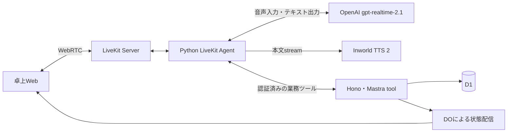

# Mastra・LiveKit・Honoの接続

[索引](../README.md) / [発話仕様](speech.md) / [上流パッチ](upstream-patch.md)

## 採用する経路

通常音声はhalf-cascadeで動かす。OpenAI Realtime 2.1が音声を直接理解して応答とツール呼出しを生成し、Inworld TTSがテキストを読み上げる。Inworld STTの確定を応答生成の待ち条件にしない。OpenAI側の音声出力は無効にする。

公式LiveKit OpenAI plugin 1.8.0の `RealtimeModel(model="gpt-realtime-2.1", modalities=["text"])` と、SHA固定したInworld TTS pluginを使用する。独自WebSocketクライアントやprivate monkeypatchは使わない。[LiveKitの外部TTS接続](https://docs.livekit.io/agents/models/realtime/plugins/openai/) / [OpenAIモデル仕様](https://developers.openai.com/api/docs/models/gpt-realtime-2.1)

## 業務ツールとターンの認可

1. Honoが端末・卓を認可し、LiveKit参加資格を発行する。
2. Pythonが `/internal/voice/config` と `/internal/voice/realtime` から音声設定、接客プロンプト、JSON Schemaのツール定義を取得する。秘密鍵をこれらの応答に含めない。
3. LiveKitのローカルVADで発話終了を検出し、公開 `on_user_turn_completed` hookでAPIにターンを予約する。その後SDKが音声をRealtimeへcommitする。字幕を待たない。
4. Realtimeのfunction callをPythonの汎用proxyが `/internal/voice/tools` へ渡す。Mastraと共有するTypeScript定義・Zod入力検証・GUI共通操作を使い、Pythonには価格や注文処理を持たせない。
5. APIが毎回、音声セッション・卓・現在turn・引数・業務版を検証する。call IDは実行前に原子的に予約し、再送や同時要求を一回だけ受け付ける。結果不明の変更を自動再実行しない。
6. テキストを到着順に字幕へ送り、演技タグを維持してInworldへ渡す。ツールだけの空応答ではTTS contextを開かない。ツール状態は既存の `voice.tool` eventで配信する。

商品名が分かる場合は `getCatalog.query` で詳細を取得する。queryなしは商品一覧で、注文・原材料の回答には詳細取得が必要。対象商品の必須選択肢・追加料金・アレルギー根拠を省略しない。画面用イベント履歴をモデルへ重複送信せず、トークン量を抑える。

`/turns` の `transport: realtime` はターン予約だけを行う。既存の `transport: cascade` とMastra streamは接続回帰・プロンプト比較用として残すが、通常のRoom dispatchはRealtimeのみを起動し、自動fallbackはしない。

## 字幕・会話文脈・割り込み

Realtimeの音声文脈を使い、補助の `gpt-4o-transcribe` は字幕だけに使う。音声item IDとAPI turn IDを対応付け、遅れて届いた字幕を元のturnへ保存する。現在の字幕結果には話者IDがないため、客番号を推測して作らない。既存の話者付きログはそのまま表示する。

Inworldの時刻付き字幕とLiveKitの公開再生情報で、実際に再生された本文を記録する。全生成文を客が聞いたことにはしない。RealtimeとTTSはLiveKitが所有し、割り込みで生成と再生を止める。APIは中断された旧turnの後続操作を拒否する。取消前にcommitしたカートや注文は維持する。

## 自発接客

無言時の自発接客はAPIの最新設定、空カート、確認・スタッフ呼出・進行中turnの有無、前回から180秒の間隔を通過したときだけ開始する。客発話として記録しない。APIは自発turnで参照以外のツールを拒否し、客が話し始めたら中断する。

## 明示停止・再開

UIの音声停止はbarge-inより強い操作である。停止状態は通常のネットワーク断と区別し、勝手に再接続しない。
初期実装ではLiveKitの音声Roomから退出し、ローカル音声トラックのcaptureを停止する。Agent側は参加者退出・セッション閉鎖でSTT・生成・TTSを終了する。
音声停止要求を受けたAPIはその音声セッションの新しいturnと古いturnの追加操作を拒否する。すでにcommitした操作は維持して画面へ表示する。
業務HTTP/DO接続、卓セッション、カート、確定ログは残す。再開は新しいvoice sessionで `/internal/voice/realtime` から同じ店舗・来店の確定字幕と再生済み本文を取得し、公開 `ChatContext` へ時系列で復元する。直近40発話・本文合計16,000文字以内に限定し、空字幕・ツールイベント・別の来店を含めない。中断の印も維持する。履歴は新しい依頼や注文承認ではなく、業務操作を再実行しない。最新の業務状態はツールで照会し、未再生音声を再開しない。
停止後のブラウザーのマイク使用表示と、外部STTへ新たなframeが送られないことを実機確認する。

## 注文確認の独立した読上げ

APIが版付き注文スナップショットと固定読上げ文を生成する。通常のLLM応答に似た確認文があっても、それを確認対象と認めない。
Mastraの準備ツールは既存の業務状態に確認actionを作る。Pythonはそのactionを既存APIから受け、通常生成と二重再生しないよう一度だけ `session.say` 等の公開機能で読む。
prepareConfirmationの後は公開 `StopResponse` でモデルの追加応答を止め、SpeechHandleの再生完了後に確認actionを取得する。
確認文は商品・選択肢の登録読上げ名と決定的な数値表現から生成し、自由な言換えや演技を加えない。
音声承認は読上げ完了後の新しい客発話が対象。途中訂正・明示停止・カート更新で以前の音声確認を失効させる。
GUI承認は表示済みの現行スナップショットに対する独立した承認経路とし、音声停止中も利用できる。

## 開発用の実音声試験

`TABLECAST_RUN_PAID_VOICE_TESTS=1 uv run --project livekit --env-file .env.local tablecast-voice-check` は、合成した日英の入力音声をRealtime 2.1へ渡し、返答をInworldで合成する明示的な有料試験。実際の業務ツール・注文確認は、空いている検証専用卓で別途試験する。本人識別、実店舗の騒音、実iPadでの受入はこの疎通試験に含めない。
